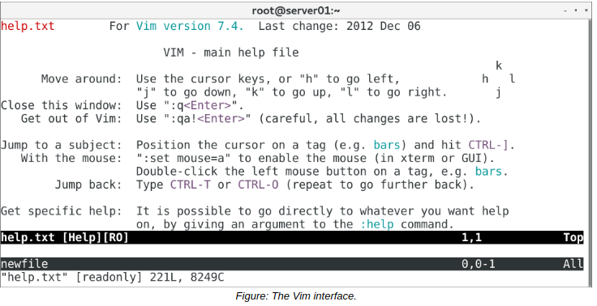

# Vim

#### Vim

**Vim**, a contraction of Vi IMproved, is an extended version of the vi editor. Vim implements a text-based user interface to advanced text editing, and is favored by many system administrators and software engineers for its efficiency and ability to be extensively customized. Vim also includes useful features such as text completion, syntax highlighting, spell checking, and many more.

#### THE vim COMMAND

The vim command invokes the Vim editor. However, the vi command may also be used for this purpose because it automatically redirects the user to Vim. When entered without a file name as an argument, the vim command opens a welcome screen by default. Use the syntax `vim {file name}` to open a file. If the file does not exist, Vim creates a file by the name specified and opens the file for editing. Vim supports multiple files being opened simultaneously.

> _Note: The vim command is not natively installed on all Linux distributions.Note: The vim command is not natively installed on all Linux distributions. To install vim, follow your distribution's installation instructions._

**WORKING WITH MULTIPLE WINDOWS**  
You can choose to display multiple files horizontally or vertically. Press **Ctrl+W+V** to create a vertical split, or press **Ctrl+W+S** to split the screen horizontally.

#### Vim Modes

Vim is a modal editor, and its different modes decide the functionality of various keys.

Mode | Enables Users To
------- | -------
Insert | Insert text by typing.
Execute | Execute commands within the editor.
Command | Perform different editing actions using single keystrokes.
Visual | Highlight or select text for copying, deleting, and so on.