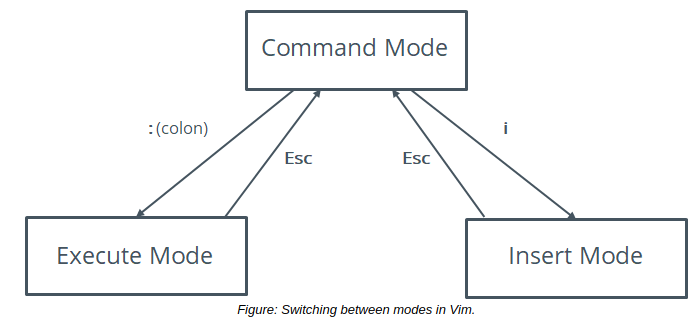

- # Switch Modes

#### Switch Modes

Command mode is the default mode of Vim, but you can switch from command mode to any other mode by using a single keystroke.

Some of the keys to switch modes are listed here.

Key | Function
------- | ------
i | Switches to insert mode and inserts text to the left of the cursor.
A | Switches to insert mode and adds text at the end of a line.
I | Switches to insert mode and inserts text at the beginning of a line.
o | Switches to insert mode and inserts text on a new line below the cursor.
O | Switches to insert mode and inserts text on a new line above the cursor.
v | Switches to visual mode to enable selection, one character at a time.
V | Switches to visual mode to enable selection, one line at a time.
: | Switches to execute mode to enable users to enter commands.
Esc | Returns to command mode.

  

#### Execute Mode Commands

In command mode, when you enter the colon (:) operator, a small command prompt section appears at the bottom-left of the editor. This indicates that you are in execute mode and can run commands supported by Vim.

Some commands supported by Vim are listed in the following table.

Command | Function
---------- | --------
:w {file name} | Saves a file with a file name if it is being saved for the first time.
:q | Quits when no changes have been made after the last save.
:q! | Quits, ignoring the changes made.
:qa | Quits multiple files.
:wq | Saves the current file and quits.
:e! | Reverts to the last saved format without closing the file.
:!{any Linux command} | Executes the command and displays the result in the Vim interface.
:help | Opens Vim's built-in help documentation.