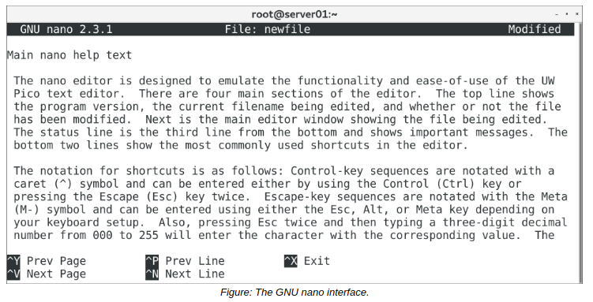

# GNU nano

#### GNU nano

**_GNU nano_** is a small, user-friendly text editor that evolved from the Pico text editor created for Unix-like systems. It was added to the GNU Project shortly after its initial release. While Vim is a powerful text editor, it is not the most user-friendly, as evidenced by its multiple modes, bare interface, and many keystroke commands—some of which are unintuitive. The nano editor, on the other hand, is more visually helpful in that it displays its command shortcuts at the bottom of every open file. Likewise, nano has fewer commands than Vim, and most command keystrokes share **Ctrl** as a common prefix. Nano does not require having to switch among different modes, as it only has one.

Despite these advantages, nano lacks many of the features that makes Vim so powerful, like split screen, text completion, syntax coloring, and more.

#### THE nano COMMAND

The nano command invokes the GNU nano editor. Without any arguments, the command will open a new file for editing, and you can later save this file with a specific name. Use the syntax nano {file name} to open an existing file. If the file does not exist, nano creates a file by the name specified and opens the file for editing. Like Vim, nano supports multiple files being opened simultaneously. These files are opened into different "buffers" that you can switch between.