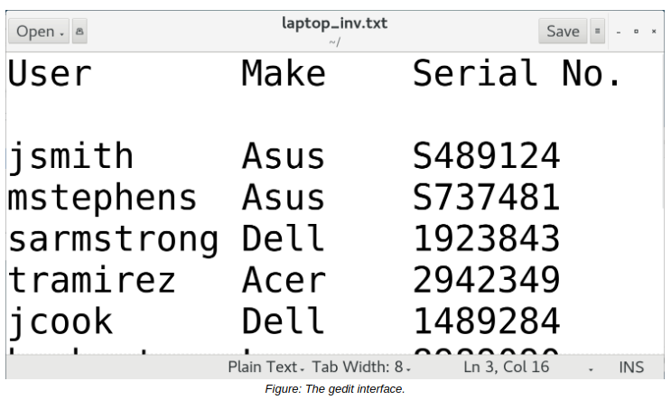

# THE gedit TEXT EDITOR

#### THE gedit TEXT EDITOR

The **_gedit_** text editor is the default text editor used in GNOME desktop environments and is a member of the GNU Project. Unlike Vim and nano, gedit has a GUI with a typical menu-based design that makes it easy to work with. It also has features like syntax highlighting and spell checking, and can be customized through plugins. While not as powerful as Vim, gedit may still be useful in systems that have a desktop environment installed.

Although you can launch gedit from the desktop, you can also use the CLI with the gedit command. The syntax is similar to vim and nano—no argument opens a new file, whereas providing a file name as an argument either opens an existing file or creates a new one with that name.

