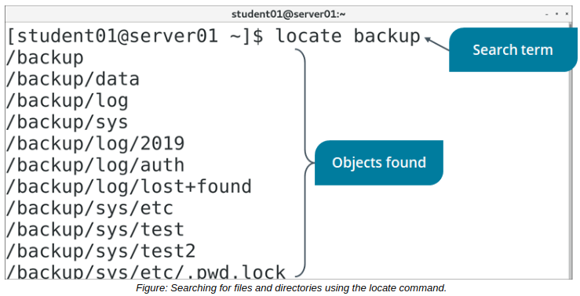

# Search for Files

> **EXAM OBJECTIVES COVERED**
> 
> _2.3 Given a scenario, create, modify, and redirect files._

There will be times that you create a file and forget where in the directory structure you put it. There will also be times when you don't know the exact location of files created by the system, applications, or other users. In Linux, you have several powerful tools for finding the files you're looking for.

#### THE locate COMMAND

The locate command performs a quick search for any specified string in file names and paths stored in the mlocate database. This database must be updated regularly for the search to be effective. The results displayed may be restricted to files that users have permissions to access or execute.

**_SYNTAX_**  
The syntax of the locate command is `locate [options] {string}`

**_locate COMMAND OPTIONS_** The locate command supports different options that enable you to make your search more effective. Some of the options are described in the table.

Option | Used To
------- | ------
\-r | Search for file names using regular expressions.
\-c | Display only the number of matching entries found, rather than the file names.
\-e | Return only files that exist at the time of search.
\-i | Ignore the casing in file names or paths.
\-l {number of entries} | Return only the first few matches up to the specified number (limit the result set).

  
**_THE updatedb COMMAND_**  
The updatedb command is used to build a database of files based on the `/etc/updatedb.conf` file. This command is used to update the `/var/lib/mlocate/mlocate.db` database. The `/etc/updatedb.conf` file consists of the paths that should be excluded while building the database. To add a path that needs to be excluded while building the database, open the `/etc/ updatedb.conf` file and, in the `PRUNEPATH` variable, specify the path that need not be included while building the database. For example, `PRUNEPATH="/etc"`will exclude the `/etc directory` while building the database.

Though this is the default database searched by the locate command, there may be more databases containing file paths. If the database is not updated before performing a search, all files created after the last update will be excluded from the search.