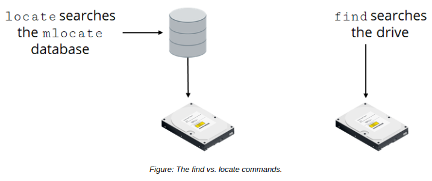

# THE find COMMAND

The find command enables you to search a specific location for files and directories that adhere to some search criteria. It recursively searches the directory structure, including any subdirectories and their contents, beginning with the search location you enter. You can perform one or more actions on the files found.

The -type switch of the search criteria enables you to specify the type of object you're looking for, such as d for directory or f for file. The -name switch is where you specify the name of the object you're looking for. The following example searches a user's home directory (and all subdirectories) for all files named 2019\_report:

`find /home/user -type f -name 2019_report` 

**_SYNTAX_**  
The syntax of the find command is `find [options] {search locations} {search criteria} [actions]`

find VS. locate COMMANDS The locate command searches a database and retrieves information on files present on your system. However, failure to keep this database updated may produce outdated results. The find command, on the other hand, performs a live search of the file system and may concentrate on a specific location. The find command may take more time to complete a search than the `locate` command.

**_ACTIONS FOR FILES FOUND_**  
When the system finds a listing that meets your criteria, there are several actions you can perform on the results, such as the ones outlined in the following table.

Switch | Action Performed
------- | ------
\-print | Displays the location of the files found.
\-exec | Executes the command that follows.
\-ok | Executes the command that follows interactively.
\-delete | Deletes files found.
\-fprint | Stores results in the target file.