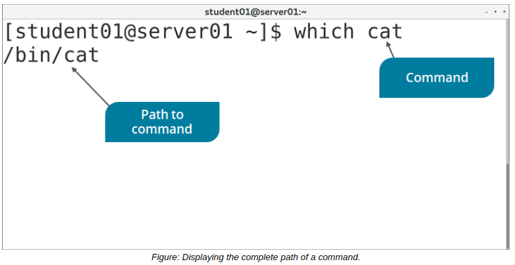
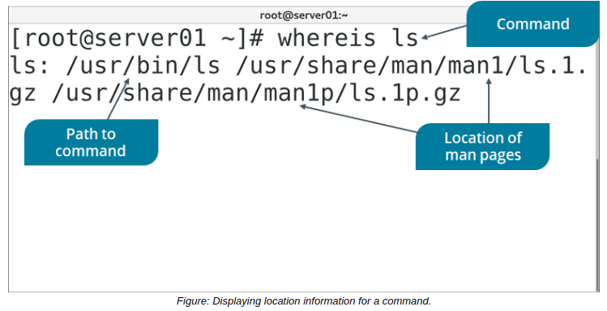

# THE which and whereis COMMAND

#### THE which COMMAND

The which command displays the complete path of a specified command by searching the directories assigned to the **_PATH variable_**. For example, upon entering `which cat`, the following output is displayed: `/bin/cat`

The which command can therefore help you locate where a program has been installed in case you need to modify this. It can also help you identify which version of a command you're using if there are multiple binaries of the command stored in different locations, one of which may be more ideal. By identifying where a command is running from, you can troubleshoot unexpected behavior from that command. 



**_SYNTAX_**  
The syntax of the which command is `which [options] {program names}`

#### THE whereis COMMAND

The `whereis` command is used to display various details associated with a command. For example, when entering whereis ls the following output is displayed:
```Bash 
ls: /bin/ls /usr/share/man/man1/ls.1.gz /usr/share/man/man1p/ls.1p.gz
```
Where `/bin/ls` indicates the location of the `ls` command and `/usr/share/man/man1/ls.1.gz /usr/share/man/man1p/ls.1p.gz` indicates the location of the man pages for the ls command.




**_SYNTAX_**  
The syntax of the whereis command is 
```Shell
whereis [options] [directory name] {file name}
```

**_whereis COMMAND OPTIONS_**  
The whereis command has several options, as described in the following table.

Option | Used To
------- | ------
\-b | Search only for binaries.
\-m | Search only for manual sections.
\-s | Search only for sources.
\-u | Search for unusual entries.