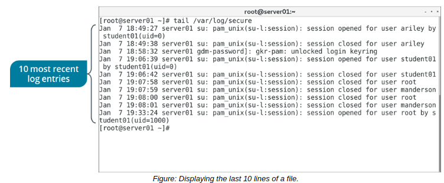

# Perform Operations on Files and Directories

> **EXAM OBJECTIVES COVERED**
> 
> _2.3 Given a scenario, create, modify, and redirect files.  
> 3.1 Given a scenario, apply or acquire the appropriate user and/or group permissions and ownership._

There are many ways you can manage a file once you've created and edited it to your liking. Using various tools, you'll ensure that your files are in the state you expect them to be in.

#### THE cat COMMAND

The cat command, short for concatenate, can display, combine, and create text files. It is most frequently used to display the contents of small text files, as it does not have a screen scrolling capability.

Some of the cat command options are described in the following tab

Option | Used To
----- | -----
\-n | Precede the output with its respective line number.
\-b | Number the lines, excluding the blank lines.
\-s | Suppress output of repeated empty lines.
\-v | Display non-printing characters as visible characters, other than tabs, new lines, and form feeds.
\-e | Print a $ character at the end of each line, prior to the new line.
\-t | Print tabs as ^I and form feeds as ^L

  
**_SYNTAX_**  
The syntax of the cat command is `cat [options] {file names}`

#### THE head AND tail COMMANDS

The head command displays the first 10 lines of each file. The tail command displays the last 10 lines of each file. These commands are useful when you only need to see the beginning or the end of a file. For example, you can check recent log entries by viewing the last 10 lines of a log file.

**_SYNTAX_**  
The syntax of the head and tail commands is `head/tail [options] {file names}`

**_tail COMMAND OPTIONS_**  
The following are some common options used with the `tail` command:

-   `-f` —dynamically watch a file (the output will automatically update when the file changes).
-   `n {number}` —show the specified number of lines, rather than the default of 10. Can also be used with the head command