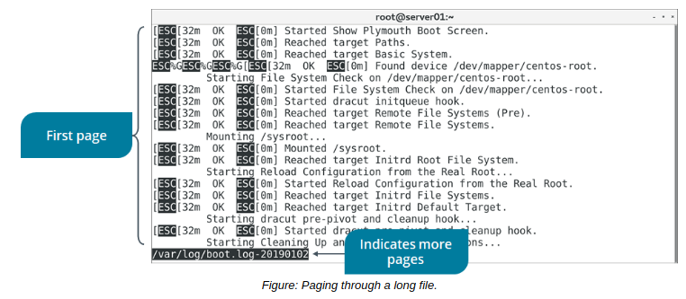

# THE less AND more COMMANDS

#### THE less AND more COMMANDS

Both the less and more commands are similar in that they enable you to display the contents of a file and page through those contents if they extend beyond the screen. The less command typically has additional features that more doesn't, but newer versions of more have added some of those features. While you're free to use either command, the less command is generally preferred.

**_SYNTAX_**  
The syntax of the less and more commands is `less/more [options] {file names}`

**_less COMMAND OPTIONS_**  
The following table lists some of the options for the `less` command.

Option | Used To
----- | ----
\-e | Exit the program the second time it reaches the end of the file.
\-E | Exit the program the first time it reaches the end of the file.
\-i | Ignore case in searches.
\-n | Suppress line numbers.

  

**_NAVIGATION_**  
Navigation in less uses many of the same commands you've seen before, like the arrow keys to scroll line-by-line and **Page Up** and **Page Down** to scroll by page. You can also use / to search a file for a particular text string, and press **n** and **N** to move to the next or previous instance of the searched string, respectively. Press **q** to quit the program