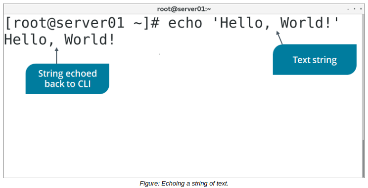

# Process Text Files

> **EXAM OBJECTIVES COVERED**
> 
> _2.3 Given a scenario, create, modify, and redirect files._

Beyond performing basic file operations like reading, moving, and copying, you can also manipulate files so that they are more useful to you. In this topic, you'll process files so that they're easier to work with based on certain business needs.

#### THE echo COMMAND

The echo command is used to display a line of text on the terminal. You can also use the echo command to write text to a file by providing the string after the echo command and redirecting to the file.



**_SYNTAX_**  
The syntax of the echo command is echo {string}

**_THE printf COMMAND_**  
The printf command is similar to echo, but provides the user with much more control over how the output is formatted. You can supply various format characters within the text you want to output, using a backslash () to indicate when they are being used. For example: `printf "Hello.\nWhat's your name?"` will print:

```Shell
Hello.
What's your name?
```

This is because \\n is the newline format character, and automatically adds a new line wherever it is placed.

The printf command also supports conversion characters, which use a percent sign (%) to indicate when they are being used. Conversion characters are typically used in scripts to change the output of a variable, like dictating the number of decimal places to print after a precise calculation.

#### THE tr COMMAND

The tr command is used to translate a string of characters. It is predominantly used to change the case of letters in a file. This command acts only on a stream of characters and does not accept file names as arguments. You must use redirection to actually change a file.

**_SYNTAX_**  
The syntax of the tr command is `tr {character 1} {character 2} where {character 1}` is the character to be replaced.