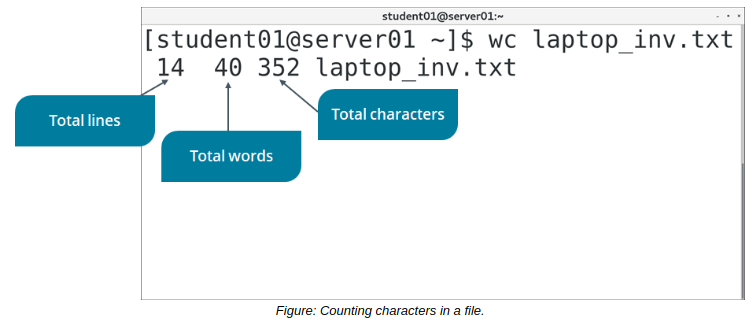
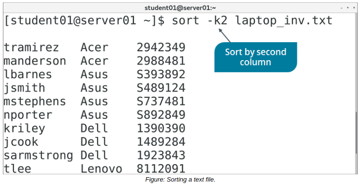

# THE wc and sort COMMAND

#### THE wc COMMAND

The word count (wc) command is used to count the number of lines, words, and characters in a text file. If multiple files are specified, then the command displays the counts for each file and the total count for all files.

**_SYNTAX_**  
The syntax of the wc command is `wc [options] {file names}`

**_wc COMMAND OPTIONS_**  
The `wc` command provides various options that enable you to specify the nature of the output.

Option | Used To
------ | -------
\-c | Display the byte count.
\-m | Display the character count.
\-l | Display the newline count.
\-w | Display the word count.
  

#### THE sort COMMAND

The sort command arranges the lines in a file. Common sort command options are provided in the table.

Option | Used To
--------- | ------
\-k{column numbers} | Sort by column number. For example, \-k2 indicates the second column.
\-n | Compare and sort lines based on the string numerical value.
\-r | Sort fields in descending order. By default, the fields are sorted in ascending order.
\-t{delimiter} | Separate one field from another.
  

> _Note: A delimiter can be a tab, space, colon, semicolon, period, or comma used to separate one field from another._

**_SYNTAX_**  
The syntax of the sort command is `sort [options] {file names}`