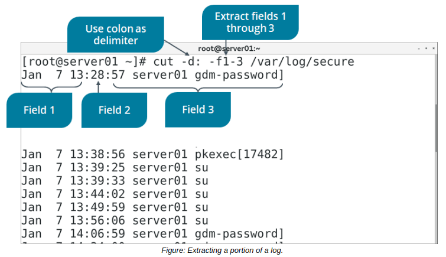

# THE cut and paste COMMAND

#### THE cut COMMAND

The cut command extracts the specified lines of text from a file. Common cut command options and their uses are given in the following table.

Option | Used To
----- | ----
\-c | Specify the number of the character to cut from each line.
\-d{delimiter} | Separate one field from another.
\-f{field numbers} | Specify the field numbers to cut on as separated by the delimiter. For example, \-f2 indicates the field between the first and second instances of the delimiter.
\-s | Suppress a line if the delimiter is not found.



**_SYNTAX_**  
The syntax of the cut command is `cut [options] {file names}`

#### THE paste COMMAND

The paste command is used to merge lines from text files horizontally. Each line of an initial file is a row in the first column; using paste, you specify a second file, and every line of the second file becomes a row in a new, second column. By default, the paste command uses a tab space delimiter to separate each column. You can use the -d option to specify a different delimiter.

For example, you have a file named `cities`:

```Markdown
New York
Tokyo
London
Lima
``` 

You also have a second file named `countries`:

```Markdown
United States
Japan
England
Peru
``` 

The output of `paste -d` , `cities countries` is as follows:

```Markdown
New York,United States
Tokyo,Japan
London,England
Lima,Peru
```