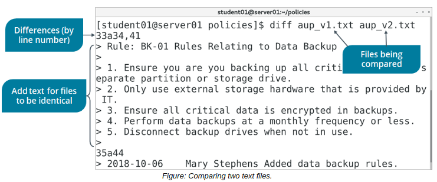

# THE diff COMMAND

#### THE diff COMMAND

The diff command is used to compare text files. The command displays the two files and the differences between them. Using various symbols, the output suggests how you can change one file to make it identical to the other. Each symbol has a special meaning.

The less than symbol (<) with a line after it means that line should be removed from the first file because it doesn't appear in the second. The greater than symbol (>) with a line after it means that line should be added from the second file. In addition, the diff command also denotes the line numbers for each file that would be affected by deletion, addition, and change operations.

> _Note: The **diff** command doesn't actually make any changes on its own._

**_SYNTAX_**  
The syntax of the diff command is `diff {file name 1} {file name 2}`

**_diff COMMAND OPTIONS_**  
The diff command has various options that enable you to specify the nature of the output.

Option | Used To
---- | ----
\-b | Ignore spacing differences.
\-i | Ignore case differences.
\-t | Expand tab characters in output lines.
\-w | Ignore spacing differences and tabs.
\-c | Display a list of differences with three lines of context.
\-u | Output results in unified mode, which presents a more streamlined format.
