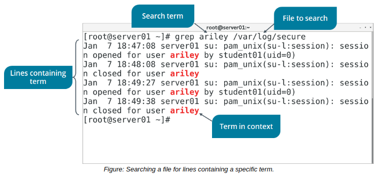

# THE grep COMMAND

#### THE grep COMMAND

The grep command, in its most basic form, is a search tool. Unlike find or locate, it is not limited to finding file names; it is most often used to search the contents of a file for a particular string of text. As output, grep displays each full line of the file that your search pattern was found in. In this way, you can use grep to both process a text file and read the contents that are most pertinent to you. For example, you may want to audit a user's login events by looking at an access log. Instead of reading the entire log or stepping through a search term in a text editor, you can simply print all of the relevant lines to the screen with the grep command.

**_SYNTAX_**  
The syntax of the grep command is `grep [options] {search pattern} {file names}`

**_grep COMMAND OPTIONS_**  
The grep command has many options. Several common ones are described in the following table.

Option | Used To
-------- | ------
\-E {pattern} | Match a pattern as an extended regular expression (ERE).
\-F {pattern} | Match a pattern as a list of fixed strings.
\-f {file name} | Match patterns contained in the specified file.
\-i | Ignore casing.
\-v | Output only lines that don't match the provided pattern.
\-c | Only print the number of matching lines, not the lines themselves.
\-l | Only print the file(s) that have matching lines, not the lines themselves.
\-o | Only print the matching part of a line, not the entire line.
  

**_USING grep TO FIND FILES_**  
In addition to searching the contents of files, you can use grep to search a directory in order to locate a certain file. The `ls -l | grep audit` command returns a long listing of any files in the current directory whose name contains "audit".

**_THE egrep COMMAND_**  
The egrep command is essentially the same as the grep -E command. However, egrep is deprecated, as grep -E is the preferred syntax.

> _Note: Regular expressions are beyond the scope of this course. For more information, navigate to **https://www.regular-expressions.info/quickstart.html.**_