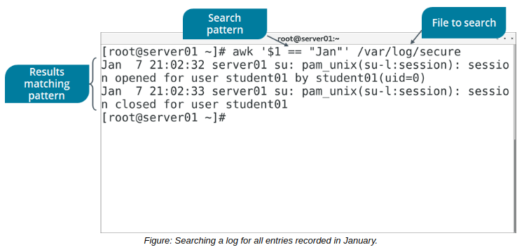

# THE awk COMMAND

#### THE awk COMMAND

The awk command performs pattern matching on files. It is based on the AWK programming language. The awk keyword is followed by the pattern, the action to be performed, and the file name. The action to be performed is given within curly braces. The pattern and the action to be performed should be specified within single quotes. If the pattern is not specified, the action is performed on all input data; however, if the action is not specified, the entire line is printed. The awk command can be executed from the command-line or from within an awk script file.

The awk command can be used to process text files in a variety of ways, such as extracting text matching a certain pattern; deleting text matching a certain pattern; adding text matching a certain pattern; and much more.

> _Note: GNU's version of_ **awk** _is called_ **gawk**

**_SYNTAX_**  
The syntax of the awk command is `awk [options] ['patterns {actions}'] {file names}`

**_PATTERNS_** In awk scripts, you can provide patterns along with blocks of code. If a pattern matches any line in the input file, the code blocks in the script will be executed. The following table lists the types of patterns used.

Pattern | Description
------ | ------ 
/regular\_expression/ | Retrieves all the records beginning with "a", "b", or "c".  `Example: /\[abc\]/`
relational\_expression | Retrieves all the records whose first field contains the value "abc"  `Example: $1 == "abc"`
pattern\_1 && pattern\_2 | Retrieves all the records whose first field contains the value "abc" and the second field contains the value "01"  `Example: ($1 == "abc") && ($2 == "01")`
pattern\_1 || pattern\_2 | Retrieves records that satisfy the condition that the first field contains the value "abc" or the second field contains the value "01" or both.  `Example: ($1 == "abc") || ($2 == "01")`
pattern\_1 ? pattern\_2 : pattern\_3 | If the first field in a record contains the value "10", the fifth field is tested for its value. If the fifth record contains the value "20", then the record is printed. If the first field of a record does not contain the value "10", then the ninth field of the record is evaluated. If the ninth record contains the value "30", then the record is printed.  `Example: $1 == "10" ? $5 == "20" : $9 == "30"`
pattern\_1, pattern\_2 | Prints a range of records, starting from the record whose first field contains the value "01". The records will be printed until the awk command finds a record whose first field contains the value "02".  `Example: $1 == "01", $1 == "02"`