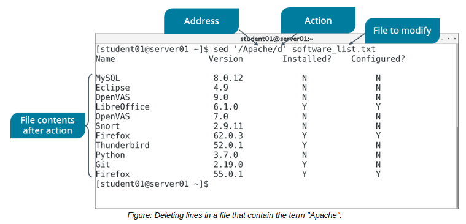

# THE sed and ln COMMAND

#### THE sed COMMAND

The sed or stream editor command is a program that you can use to modify text files according to various parameters. The sed command can also be used for global search and replace actions.

Some of the common command options and their uses are given in the following table.

Option | Used To
---- | ----
d | Delete the lines that match a specific pattern or line number.
\-n,p | Print only the lines that contain the pattern.
s | Substitute the first occurrence of the string in the file.
s,g | Globally substitute the original string with the replacement string for each occurrence in the file.
  

**_SYNTAX_**  
The general syntax of the sed command is `sed {'option/address/action'} {file names}`

Addresses tell sed to act only on certain lines or to act only on text that matches a given regular expression pattern. They are optional. Addresses are followed by the action to be performed when a match is found. The last argument is the name of the input file. The option, address, and action parameters are typically enclosed within single quotation marks.

#### THE ln COMMAND

The `ln` command is used to create a link to a file. Linking enables a file name in one directory (the link) to point to a file in another directory (the target). A link does not contain data of its own, only a reference to the target file. Any changes to the link will reflect in the target file. If you don't specify the link name, the ln command will create the link in your current working directory.

**_SYNTAX_**  
The syntax of the `ln` command is `ln [options] {target name} [link name]`

**_ln COMMAND OPTIONS_**  
The `ln` command has various options. Some of the frequently used options are given in the following table.

Option | Used To
------- | ------
\--backup | Back up existing destination files.
\-f | Remove existing destination files.
\-s | Make symbolic links instead of hard links.
\-i | Prompt to remove destination files.
\-v | Print the name of a file before linking.