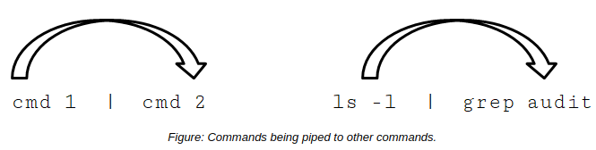

# Piping AND THE xargs COMMAND

#### Piping

Piping is the process of combining the standard I/O streams of commands. It uses the standard output of one command as the standard input for another command. The output format of the first command should be compatible with the format that the second command works with. The pipe operator (|) can be used with most commands in Linux.



**_PIPING EXAMPLE_**  
The `ls -l | grep audit` command mentioned earlier that searches for files named "audit" is an example of using a pipe. The standard output of the `ls -l` command is fed as standard input into the grep audit command, so that grep searches for the term within the directory listing.

#### THE xargs COMMAND

The xargs command reads from standard input and executes a command for each argument provided. Each argument must be separated by blanks. The pipe operator is used to make the output of the first command the input for the second command. The xargs command is commonly used with the find command to operate on each result that is found within the file or directory search.


**_SYNTAX_**  
The general syntax of the `xargs` command is command `[options] [arguments] | xargs [options] {command}`

**_EXAMPLE OF THE xargs COMMAND_**  
Let's say you want to delete all of the files in the /foo directory that have a .pdf extension. You can use xargs to automate the process:

```Shell
find /foo -type f -name "*.pdf" | xargs rm
``` 

The find command searches for all files in /foo that have a .pdf extension, then pipes the result to the xargs command. Because the results are delimited by a space, the xargs command will execute the rm command for each file in the results—removing all PDF files in the directory.

**_xargs COMMAND OPTIONS_**  
The xargs command has various options.

Option | Used To
------ | ------
\-I {replacement string} | Consider each line in the standard input as a single argument.
\-L {number of lines} | Read a specified number of lines from the standard input and concatenate them into one long string.
\-p | Prompt the user before each command.
\-n {number of arguments} | Read the maximum number of arguments from the standard input and insert them at the end of the command template.
\-E {end of string} | Represent the end of the standard input.
\-t | Write each command to the standard error output before executing the command.
\-s {max size} | Set the maximum allowable size of an argument list to a specified number of characters.