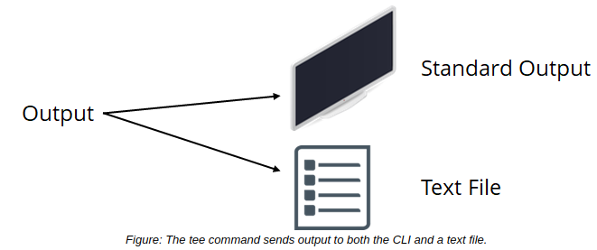

# THE tee COMMAND

#### THE tee COMMAND

The tee command reads the standard input, sends the output to the default output device (the CLI), and also copies the output to each specified file. This command enables you to verify the output of a command immediately as well as store that output in a file for later reference. Like xargs, tee typically accepts input from another command using the pipe operator.

When used with the -a option, tee appends the output to each output file instead of overwriting it.



**_SYNTAX_**  
The general syntax of the `tee` command is command `[options] [arguments] | tee [options] {file names}`

**_EXAMPLE OF THE tee COMMAND_**  
Let's say you want to check the contents of a directory and also output those contents to a file to process later. You could issue separate commands to do this, or you can use the tee command like so:

```Shell
ls -l | tee listing.txt
``` 

#### THE /dev/null FILE

The `/dev/null` file, also known as the **_null device_**, is a file that discards all data written to it. Typically, you'd redirect an output stream to this file in order to confirm that the write operation was successful without actually writing to anything. This makes the file useful in testing commands, scripts, and other software. It is also useful in suppressing error information in commands by redirecting error output (2>) to the `/dev/null` file.

#### Terminal Redirection

A running process in Linux can be controlled by a terminal (CLI), and multiple terminals can run at once. Each controlling terminal is assigned an identifier. This identifier usually takes the format `/dev/tty#` where # is a number unique to that terminal. You can redirect standard input and output to another controlling terminal by referencing its `/dev/tty` number. This can be useful when you need to redirect text streams between different running processes.

> _Note: You can enter_ **tty** _at the CLI to identify your controlling terminal._