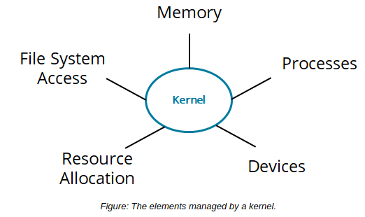
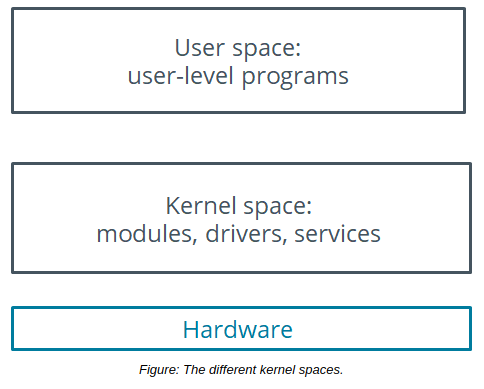

# Explore the Linux Kernel

You'll begin by identifying some of the key concepts and components that make up the Linux kernel. This will give you a better sense of what services the kernel provides and how you might go about customizing those services.

#### Kernel

The **_kernel_** is the core of an operating system. All other components rely on it. The kernel manages file system access, memory, processes, devices, and resource allocation on a system. The kernel also controls all the hardware devices plugged into the system. It is one of the first elements to be loaded on startup and remains in the main memory during the computer's operation. The kernel also contains system-level commands and other functions that are normally hidden from users.

#### Kernel Space and User Space

Kernels tend to divide software running in memory into two spaces: kernel space and user space. The **_kernel space_** is simply where the kernel executes the services that it provides. The **_user space_** is the area of memory that includes everything outside of kernel space. This can include everything from high-level applications that the user interacts with directly, to processes that run in the background, to various low-level system libraries.

Software running in user space is able to access resources provided by kernel space through the use of system calls. These calls provide a user space application with the resources it needs to perform a task. For example, an application might issue a system call to the kernel so that it can leverage input/output (I/O) services that write data to a storage device.

The split between these two memory regions is useful because it promotes greater stability and security. Software in one space cannot necessarily interfere with software in the other

#### Types of Kernels

Kernels can be classified as monolithic or microkernel. In a **_monolithic kernel_**, all system modules, such as device drivers or file systems, run in kernel space. As a result, a monolithic kernel can interact quickly with devices. However, its main disadvantage is its size, which leads to higher consumption of RAM. In addition, a failure in a device driver can lead to system instability in a monolithic kernel.

In a **_microkernel_** architecture, the kernel itself runs the minimum amount of resources necessary to actually implement a fully functional operating system. Compared to monolithic kernels, microkernels have smaller kernel spaces and instead have larger user spaces. This means microkernels are smaller in overall size and consume less memory. In addition, they are typically more stable. However, microkernels tend to offer worse performance than monolithic kernels.

**_DEVICE DRIVERS_**  
A **_device driver_** is a software program that enables a computer's operating system to identify the characteristics and functions of a hardware device, communicate with it, and control its operations. It acts as an interface between the operating system and hardware devices such as storage drives, printers, scanners, monitors, and keyboards. Device drivers can be included in the operating system or installed on demand.