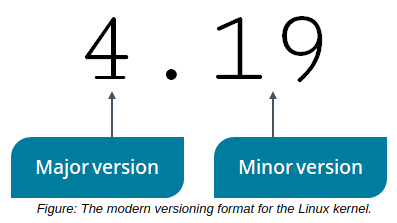
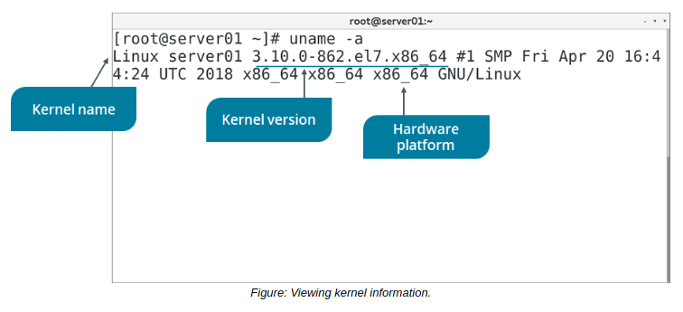

# The Linux Kernel

#### The Linux Kernel

The **_Linux kernel_** is a free and open source monolithic kernel that manages all other resources on the operating system. As a monolithic kernel, device drivers run within kernel space and have full access to hardware. The architecture of the Linux kernel provides many useful features, including virtual memory management, support for TCP/IP networking, shared libraries, and many more.

One important quality of the Linux kernel is its modularity. This enables users to configure and extend kernel functionality to meet their needs.

The Linux kernel is continually updated by creator Linus Torvalds and many other volunteers. Each new version of the kernel is given a kernel version number to distinguish it from past and future versions. The current naming convention for kernel versions is major.minor where major is the major version number and minor is the minor version number. For example, version 4.19 was released in October 2018.

**_KERNEL VERSION HISTORY_**  
For versions 2.6.39 and prior, the kernel number format was w.x.y.z where w is the major version number, x is the major revision number, y is the minor revision number, and z is the patch number.

After 2.6.39, Torvalds decided to shorten the version number format, and the next version number was 3.0. After 3.19, rather than proceed to 3.20, Torvalds decided to jump to 4.0. This was for readability purposes, not due to any technical advances. Newer versions of the kernel will continue this trend of avoiding large minor numbers.

#### THE uname COMMAND

By default, uname prints the name of the kernel—Linux. You can view the kernel version number of your current system by using the uname -r command. You can also enter uname -i to view the hardware platform. To print all information, enter the uname -a command.

