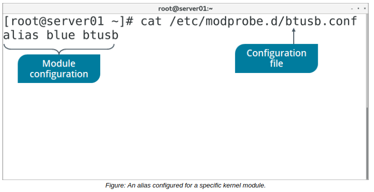

# Kernel Module Configuration

#### Kernel Module Configuration

The `/etc/modprobe.conf` file is a configuration file that contains settings that apply persistently to all the modules loaded on the system. It is used to configure modules and their dependencies and also specify module aliases. An alias is just an alternative name to use for a module.

In newer Linux distros, this file is deprecated. The `/etc/modprobe.d/` directory is used instead, and contains various .conf files. Other than creating aliases, these files can tell modprobe to run additional modules with specific options when your chosen module is loaded into the kernel. This enables the chosen module to leverage another module's functionality without actually loading it into the kernel. You might do this when your module doesn't directly depend on a second module, but does run better if that second module is installed.  **_CONFIGURATION FILE COMMANDS_**  
Files ending in .conf in the `/etc/modprobe.d/` directory can use one of several commands.

Command | Used To
------- | ----------
alias {alternative name} {module name} | Specify an alternative name for a module with a long name.
blacklist {module name} | Ignore internal aliases, which occur when modules define their own aliases.
install {module name} {command} | Run the specified command without inserting the module into the kernel.

