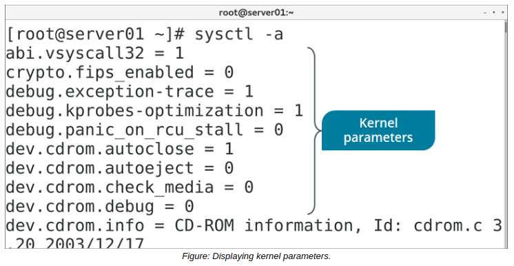

# Kernel Parameters

#### Kernel Parameters

In addition to loading modules into the kernel at runtime, you can also change some of the kernel's parameters while it is running. You can use these parameters to improve system performance, harden security, configure networking limitations, change virtual memory settings, and more.

The `/proc/sys/` directory lists the parameters that you can configure on your system. Like the directories containing kernel modules, this `/proc/sys/` directory is divided into several categories, including the following.

Directory | Includes Parameters Related To
------- | ---------
crypto | Encryption and other cryptographic services.
debug | Debugging the kernel.
dev | Specific hardware devices.
fs | File system data.
kernel | Miscellaneous kernel functionality.
net | Networking functionality.
user | User space limitations.
vm | Virtual memory management.

  

#### THE sysctl COMMAND

The sysctl command is used to view or set kernel parameters at runtime. It has various options, as defined in the following table.

Option | Used To
---- | -----
\-a | Display all parameters and their current values.
\-w {parameter}={value} | Set a parameter value.
\-p \[file name\] | Load sysctl settings from the specified file, or /etc/sysctl.conf if no file name is provided.
\-e | Ignore errors about unknown keys.
\-r {pattern} | Apply a command to parameters matching a given pattern, using extended regular expressions.

  

**_SYNTAX_**  
The syntax of the sysctl command is `sysctl [options]`

**_THE /etc/sysctl.conf FILE_**  
The `/etc/sysctl.conf` file enables configuration changes to a running Linux kernel. These changes might include improvements to networking, security configurations, or logging of information.