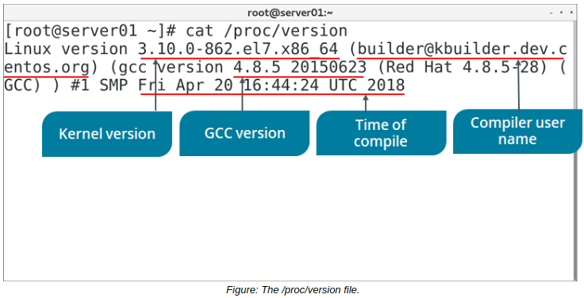

# Monitor Kernel Modules

> **EXAM OBJECTIVES COVERED**
> 
> _1.2 Given a scenario, install, configure, and monitor kernel modules.  
> 2.7 Explain the use and operation of Linux devices._

After you install and configure kernel modules, it's a good idea to monitor those modules. In this topic, you'll verify that the modules you installed were actually loaded into the kernel, and that any configurations you made were implemented properly.

#### THE /proc/ DIRECTORY

The /proc/ directory is a virtual file system (VFS) that provides significant information about the kernel's running process. Some of the files in the /proc/ directory are listed in the following table.

File | Contains
------ | -------
/proc/cmdline | Options passed to the kernel by the boot loader at boot time, such as mounting the kernel as read-only.
/proc/cpuinfo | CPU information, such as its architecture, name, clock speed, cache size, and more.
/proc/devices | A list of character and block device drivers loaded into the currently running kernel.
/proc/filesystems | A list of file systems types that are supported by the kernel, as well as if any are currently mounted.
/proc/meminfo | Information about RAM usage, including total memory, free memory, and much more.
/proc/modules | Information about modules currently installed on the system. An alternative to the lsmod command.
/proc/stat | Various statistics about the system since it was last rebooted.
 

> _Note: Recall that **/proc/mounts** and **/proc/partitions** are also available here._

#### THE /proc/version FILE

The `/proc/version` file specifies several points of information about the Linux kernel:

-   The version of the Linux kernel currently running.
-   The version of the GNU Compiler Collection (GCC) used to compile the kernel.
-   The user name of the kernel compiler.
-   The time the kernel was compiled.

The version of the kernel may impact system functionality, so you can use this file to validate that version.

> _Note: Remember, you can also use the `uname -r` command to retrieve the kernel version._
> 
> _Note: GCC originally stood for GNU C Compiler because it only supported the C programming language. It now works with several programming languages._
