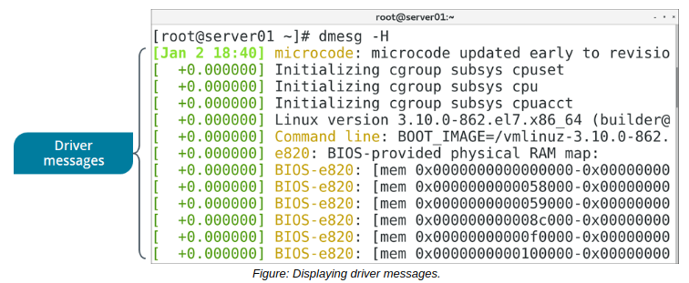

# THE dmesg COMMAND

#### THE dmesg COMMAND

The dmesg ("display message" or "driver message") command is used to print any messages that have been sent to the kernel's message buffer during and after system boot. Device drivers send messages to the kernel indicating the status of modules and parameters that the drivers interface with. These drivers can also send diagnostic messages to the kernel in case they encounter errors. Other kernel components can also send messages to the buffer.

In addition to using the dmesg command, you can also access the message buffer from the /var/log/dmesg file. In either case, you can leverage dmesg to look for potential issues with kernel components or to validate that certain modules are being loaded.

**_SYNTAX_**  
The syntax of the `dmesg` command is `dmesg [options]`

**_dmesg COMMAND OPTIONS_**  
You can use various options with the dmesg command.

Option | Used To
----- | --------
\-c | Clear the kernel buffer after printing its contents.
\-f {facility list} | Restrict output to the specified comma-separated list of facilities. A facility is a component category that is producing messages, such as user for user-level messages.
\-l {level list} | Restrict output to the specified comma-separated list of levels. A level defines a message's nature and priority, such as noticefor messages that aren't considered critical.
\-e | Display a human-readable version of the time of each message as well as its delta, or the difference in time between subsequent messages.
\-L | Color-code messages for easier readability.
\-H | Output in a human-friendly format, combining both \-e and \-Loptions and using a text pager.
\-h | List the available options, as well as the available facilities and levels.