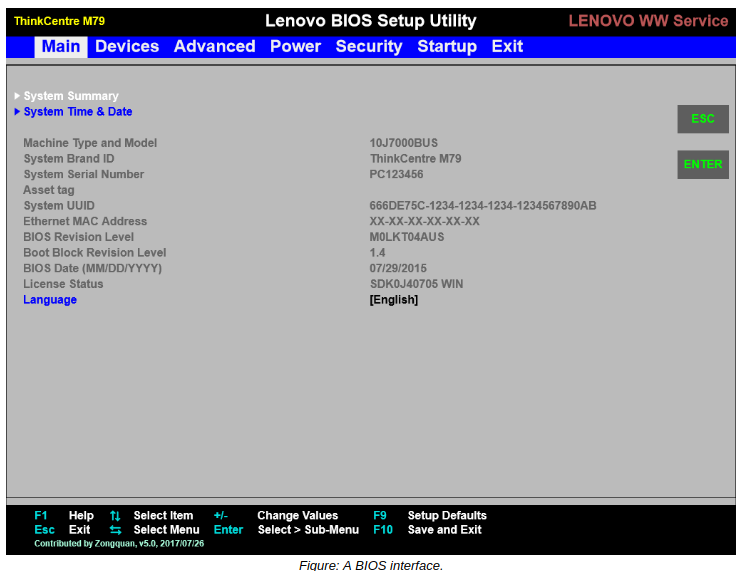

# BIOS and UEFI

#### BIOS

The **_Basic Input/Output System (BIOS)_** is a standard for firmware interfaces and is stored on a computer motherboard's ROM chip. When a computer with BIOS is powered on, the BIOS firmware is the first to run; this enables it to test the various hardware components in a computer, as well as run a boot loader so that an operating system can start. The BIOS has access to the ports used by basic hardware input devices like a mouse and keyboard. Users can also load up a BIOS interface instead of an operating system to make various hardware-level changes. For several decades, BIOS was the dominant standard in the home and enterprise computer industry.

#### UEFI

**_Unified Extensible Firmware Interface (UEFI)_** is newer firmware technology that has largely replaced BIOS by bringing with it several key advantages. UEFI runs faster than BIOS, can operate within a greater amount of memory, can access storage drives of currently unattainable sizes, can access more hardware types, and has improved security protections. Most modern motherboards, as well as the pre-assembled PCs that use them, ship with UEFI.

Like BIOS, UEFI provides an environment with which to execute a boot loader, and ultimately start up the operating system for the user to work with.

**_PASSWORD PROTECTION_**  
One security feature that both BIOS and UEFI include is the ability to set a password. If this password is not provided at boot time, the system will not boot. Since BIOS/UEFI firmware differs between hardware manufacturer, the process of setting this password is not consistent. However, most firmware places this password protection option in a "Security" or "Password" section.