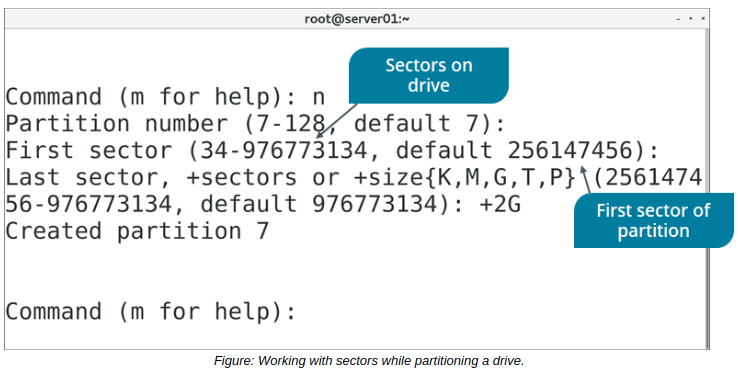

# Sectors, MBR, and GPT

#### Sectors

A **_sector_** is the smallest unit of storage read from or written to a drive. A sector stores 512 bytes of data by default. On hard disk drives, a collection of sectors is called a track. The number of sectors in a track may vary, and so does their capacity to hold data. The size of a sector can be altered when formatting the drive.

#### MBR

The **_master boot record (MBR)_** is the first physical sector on a storage drive and a type of partition structure. The MBR boot sector contains the boot loader that loads the operating system into memory. It also contains the partition table of the storage drive. MBR determines what sectors are available to each partition, as well as which partition is considered bootable and which partitions are not.

For many years, MBR was the dominant partition structure used in Linux and other operating systems. However, it has three major disadvantages:

-   The maximum storage space of an MBR-partitioned drive is two terabytes.
-   MBR-partitioned drives can have a maximum of four primary partitions.
-   The boot data is stored in one sector, which increases the risk of corruption.

#### GPT

The **_GUID Partition Table (GPT)_** is a successor to MBR that makes up for the latter's shortcomings. Like MBR, it is a partition structure, but it employs a more modern design and is part of the UEFI standard. Every partition on a drive is assigned a globally unique identifier—a GUID—to distinguish it from every other partition on (theoretically) every drive.

The storage space and partition number maximums are so large that they are not currently achievable, and any limitations are going to be imposed by the file system type or operating system kernel, rather than GPT itself. GPT also has the advantage of storing its boot data in multiple locations on a drive to enhance redundancy. If the primary location is corrupted, GPT can leverage one of the other copies to restore the boot data.

Whenever possible, partitioning a drive with GPT is preferable to MBR.

**_RAW PARTITION_**  
Other than formatting a partition as MBR or GPT, you can also format a partition as raw. A **_raw partition_** enables users and applications to read from and write to a block storage device directly, without using the system cache. This is useful in situations where software like a database management system (DBMS) has its own caching mechanism. The DBMS has greater control over I/O caching in a raw partition and can bypass the caching normally done by the kernel.