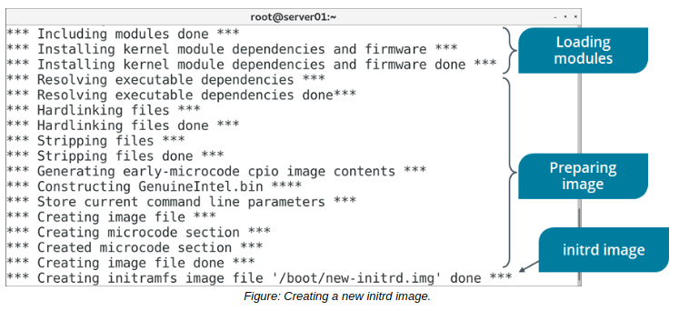

# initrd

#### initrd

The initial ramdisk (initrd) refers to the root file system that is temporarily loaded into memory upon system boot. The initrd loads along with the kernel, which controls its functionality. The initrd enables the system to be started in two phases. In the first phase, the system is booted with the minimal set of modules required to load the main or the permanent root file system. In the second phase, when the main root file system is mounted, the previously mounted initrd file system is removed and the user space boot process continues.

The initrd is useful because there are many potential variables that can complicate the boot process. For example, the kernel needs to find and load the necessary device driver modules, as well as the actual root file system itself. There's also the possibility that the root file system uses one of several advanced storage methods, like LVM or NFS, which have different mount requirements than a standard partition. Rather than hardcode all of this behavior in the kernel and introduce bloat, the initrd's temporary root file system can handle these tasks.

#### THE initrd IMAGE

The Linux **_initrd image_** is an archive file containing all the essential files that are required for booting the operating system. It can be built or customized to include additional modules, remove unnecessary modules, or update existing modules. Typically, this image is stored in the /boot directory.

#### THE mkinitrd COMMAND

The mkinitrd command is used to create the initrd image for preloading the kernel modules.

Various options of the `mkinitrd` command are given in the following table.

Option | Used To
--------- | -----------
\--preload={module name} | Load a module in the initrd image before the loading of other modules.
\--with={module name} | Load a module in the initrd image after the loading of other modules.
\-f | Overwrite an existing initrd image file.
\--nocompress | Disable the compression of the initrd image.

  

**_SYNTAX_**  
The syntax of the `mkinitrd` command is `mkinitrd [options] {initrd image name} {kernel version}`

The following example creates an initrd image from the current kernel version and names the image `initrd-<kernel version>.img:`

`mkinitrd /boot/initrd-$(uname -r).img $(uname -r)`