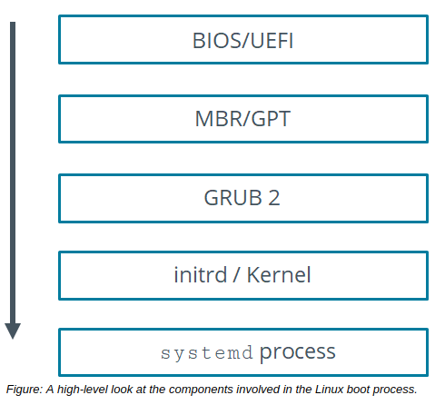

# THE /boot/ DIRECTORY and The Boot Process

#### THE /boot/ DIRECTORY

As defined by the Filesystem Hierarchy Standard (FHS), the `/boot/` directory contains files that are used to facilitate the Linux boot process. The following table describes some of the files and subdirectories in `/boot/` that are of note.

File or Directory | Description
---------- | --------------
/boot/grub/ |This directory contains configuration files for a type of boot loader called GRUB. The /boot/grub2/directory does likewise, but for GRUB 2, an improved version.
/boot/efi/ | This directory contains boot files for an EFI system partition (ESP), which is a required partition for systems that boot from UEFI. It contains boot loader, device driver, and system application files that are executed by UEFI. Boot loader files are typically named with a .efi extension.
/boot/initramfs-\<kernel version>.img | This file is an initramfs image, which is an alternative to initrd that uses different methods to do the same basic thing: initialize a temporary root file system on boot. Whereas initrd requires a special driver to be compiled into the kernel, initramfs does not. In addition, the initrd image is a block device formatted with a fixed-size file system, whereas the initramfs image is an archive file that can be sized dynamically.
/boot/vmlinuz-\<kernel version> | This is a compressed executable file that contains the Linux kernel itself. The boot loader loads this file into memory during the boot process to initialize the operating system. A related file is vmlinux, which is essentially the non-compressed version of the kernel used for debugging.
  
**_THE dracut COMMAND_**  

The dracut command is used to generate an initramfs image, similar to how `mkinitrd` is used to generate an initrd image. In fact, on some distributions, `mkinitrd` is a compatibility wrapper that calls the dracut command.

An example of using the dracut command to create an initramfs image is as follows:

`dracut /boot/initramfs-$(uname -r).img $(uname -r)` 

#### The Boot Process

The boot process is repeated each time your computer is started by loading the operating system from a storage device. It involves a series of sequential steps that can be divided into BIOS/UEFI initialization, boot loader, kernel and initrd/initramfs initialization, and boot scripts.

The following is an example boot process that uses an initrd image:

1.  The processor checks for the BIOS/UEFI firmware and executes it. This is also where the power-on self-test (POST) occurs.
2.  BIOS/UEFI checks for bootable media from internal storage devices or peripherals like USB thumb drives and DVD-ROMs. It locates a valid device to boot the system.
3.  BIOS/UEFI loads the primary boot loader from the MBR/GPT partition into memory. It also loads the partition table along with it.
4.  The user is prompted by GRUB 2 to select the operating system they want to boot. If the user does not respond, then the default operating system will be booted.
5.  The boot loader determines the kernel and locates the corresponding kernel binary. It then uploads the respective initrd image into memory and transfers control of the boot process to the kernel.
6.  The kernel configures the available hardware drivers, including processors, I/O subsystems, and storage devices. It decompresses the initrd image and mounts it to load the necessary drivers. If the system implemented any virtual devices, such as LVM or software RAID, then they are initialized.
7.  The kernel mounts the main root partition and releases unused memory. To set up the user environment, the systemd program is run. It becomes process ID 1.
8.  The systemd program searches for the default.target file, which contains details about the services to be started. It mounts the file system based on the `/etc/fstab` file and begins the process of starting services. On most systems, the target will either be `multi-user.target` or `graphical.target`.
9.  If graphical mode is selected, then a display manager like XDM or KDM is started and the login window is displayed on the screen.
10.  The user enters a user name and password to log in to the system.
11.  The system authenticates the user. If the user is valid, then various profile files are executed.
12.  The shell is started and the system is ready for the user to work on.