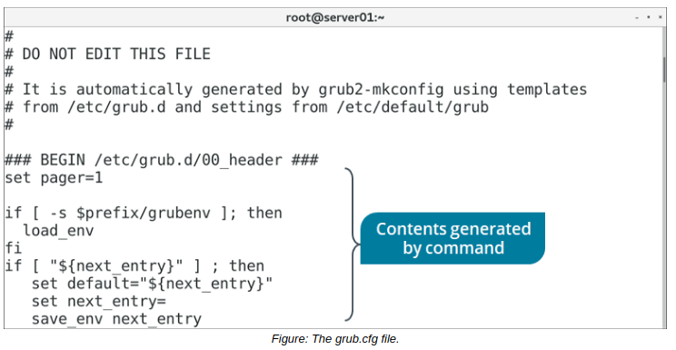

# GRUB 2 Installation

#### GRUB 2 Installation

The grub2-install command is used to install the GRUB 2 boot loader on a storage device. It copies GRUB 2 files into the `/boot/grub2` directory and, on some platforms, installs GRUB 2 into the boot sector. However, `grub2-install` applies to BIOS systems, not UEFI. To install GRUB 2 on a UEFI system, use a package manager to install the `grub2-efi` package. Installing this package will copy GRUB 2 files onto the EFI system partition (ESP) in the `/boot/efi directory`.

**_SYNTAX_**  
The syntax of the `grub2-install` command is `grub2-install [options] [device name]`

**_grub2-install COMMAND OPTIONS_**  
The following are some options you can use with the `grub2-install` command:

Option | Used To
--------- | -----------
\--modules {module names} | Preload the specified kernel modules with the GRUB 2 boot loader.
\--install-modules {module names} | Install only the specified modules and their dependencies, rather than the default of installing all available modules.
\--directory {directory name} | Install files from the specified directory, rather than the default.
\--target {target platform} | Specify the target platform to install GRUB 2 for, rather than the platform that is currently running.
\--boot-directory {directory name} | Specify the boot directory to install GRUB 2 files to, rather than the default /boot/ directory.
\--force | Install GRUB 2 regardless of detected issues.
 

#### THE grub.cfg FILE

The `grub.cfg` file is the main configuration file for the GRUB 2 boot loader. On BIOS systems, it is located in the `/boot/grub2/` directory. On UEFI systems, it is located in the `/boot/efi/EFI/<distro>/` directory. For example, on CentOS 7, the path is:

`/boot/efi/EFI/centos/grub.cfg` 

This file is an executable shell script. Don't edit this file directly, as it is generated using a specific command that leverages configuration scripts stored elsewhere on the file system.

> _Note: On RHEL/CentOS 7, `/etc/grub2.cfg` is a symbolic link to the `grub.cfg` file. This maintains a legacy path option, as the original GRUB configuration file used to be located at `/etc/grub.cfg </i>`_