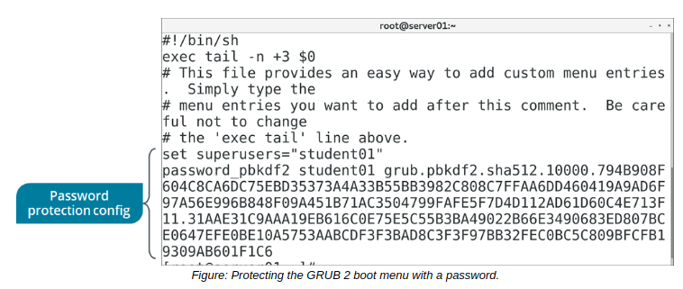

# THE /etc/grub.d/ DIRECTORY and GRUB 2 Boot Menu Customization

#### THE /etc/grub.d/ DIRECTORY

The `/etc/grub.d/` directory contains scripts that are used to build the main `grub.cfg` file. Each script provides various functions to GRUB 2 and is numbered so that the scripts can execute in a sequence. It's usually not a good idea to edit the existing scripts in this directory. If you want to add a custom script, then you can place it in this directory with a ##\_ file name prefix, depending on what order you want the script to be executed in. You can also add your script to the existing 40\_custom file so that it executes last by default.

#### GRUB 2 Boot Menu Customization

The `/etc/grub.d/40_custom` file enables the customization of the menu presented to the user during the boot process. GRUB 2 will offer the user a menu of installed operating systems to choose from. This choice is useful for multi-boot scenarios (more than one operating system available on the computer), booting to different Linux kernels, or for booting into a rescue mode. The menu contents may be customized by editing the /etc/grub.d/40\_custom file, enabling an administrator to specify the order of the menu choices, provide user-friendly names, and to password protect menu entries.

**_GRUB 2 PASSWORD GENERATION_**  
You can generate a password hash to protect the boot menu by using the `grub2-mkpasswd-pbkdf2` command.