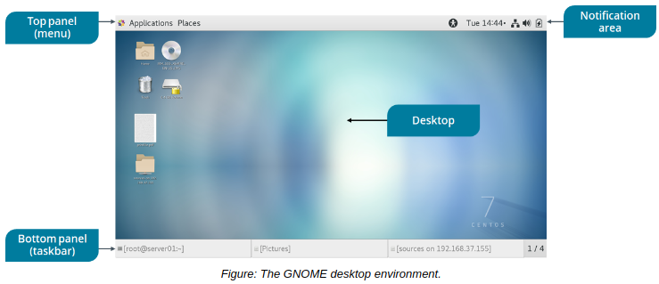

# Desktop Environment

#### Desktop Environment

A _**desktop environment**_, also known as a _**window manager**_, is a client to a display server that tells the server how to draw graphical elements on the screen. In other words, the desktop environment controls the look and feel of the GUI for the entire operating system, providing a common graphical interface for applications running in the environment.

Desktop environments implement the desktop metaphor, in which the user's monitor is treated as if it were the top of a physical desk, where various objects are placed and accessible to the person sitting at the desk. The primary structural element of a desktop metaphor is the application window, and within each window there can exist various graphical elements like buttons, icons, menus, toolbars, and more. Desktop environments also provide a graphical login screen and can be customized to run every time the system boots. In most cases, the desktop environment will also come packaged with a variety of different GUI applications, like a file browser, web browser, text editor, and more.

> _Note: Some desktop environments can run on X, Wayland, or both._

#### Specific Desktop Environments

There are many desktop environments available for Linux, the most common of which are described in the following table.

Desktop Environment | Description
------- | -------
GNOME | This is the default desktop environment in most Linux distributions. It can run on both X and Wayland. GNOME follows design principles called human interface guidelines (HIG) that emphasize clarity of focus, simplicity, limiting the amount of work the user has to perform, and many more. GNOME also offers a great deal of support for people with disabilities.  The GNOME Shell is the actual user interface used by the desktop environment, and it defines the placement and look of elements like toolbars, menus, and more. Starting with version 3, GNOME changed from using a typical desktop metaphor to a more abstract metaphor in which users can switch between virtual desktops and tasks from an overview screen.  There is also the GNOME Classic shell, which provides a user interface similar to GNOME version 2 even with version 3 installed. Canonical also developed the Unity shell for GNOME on Ubuntu, but switched to using GNOME 3 in 2018. Unity was initially designed to make better use of space on devices with small screens, such as netbooks. For example, the app launcher on the left side of the screen is always present in Unity—requiring a single click to launch an app—whereas it requires keyboard input or moving the mouse to the top-left corner of the screen in order to appear in the GNOME Shell.
KDE Plasma | While not as popular as GNOME, KDE Plasma is the second-most common desktop environment and is included in distributions like RHEL and CentOS, even if not set as the default. As of 2018, the current version is KDE Plasma 5.  KDE Plasma supports modularity through widgets, enabling users to add, move, and remove screen elements to fit their own personal workflow. KDE Plasma also has a robust set of GUI apps, including word processors, mail clients, multimedia software, and more. It supports both X and Wayland.
Cinnamon | This is actually a fork of GNOME 3 and is one of the default environments for the Linux Mint distro. Cinnamon was developed in response to the changes in GNOME 3, and uses a typical desktop metaphor rather than an abstract one. It is therefore similar to GNOME 2. However, as of 2018, Cinnamon does not support Wayland.
MATE | This is another fork of GNOME that was created in response to the changes in GNOME 3. It was developed to maintain and extend the functionality of GNOME 2. Many of its GUI applications are forked versions of the GNOME Core Applications. MATE is the other default environment for Linux Mint, and is also available as an option in some other distributions. Like Cinnamon, it does not currently support Wayland.

  
**_CHOOSING THE RIGHT DESKTOP ENVIRONMENT_**  
None of these desktop environments is an objectively "right" choice. Which environment you choose will ultimately come down to personal preference and your comfort level with each. You need to try each environment in order to know which is best for you.