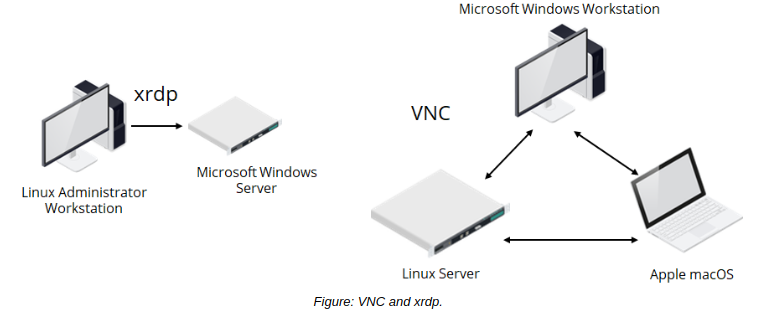

# Remote Desktop

#### Remote Desktop

_**Remote desktop**_ is a concept in which a client connects to a remote system over a network, and is able to sign in to and use the desktop environment of that system. Remote desktop sessions are useful in situations where you must configure a server that has a GUI, but you aren't physically located at that system. In addition, remote desktop sessions are used in an environment where the user connects to and works with their remote computer as if it were located in front of them—in other words, the remote session becomes their primary desktop.

The client computer typically constructs the remote session in its own window, and, when that window has focus, any input on the local client (e.g., a keystroke) gets translated and sent to the remote desktop as if the keystroke were being performed on that system directly.

#### Remote Desktop Software

There are many software packages available for Linux that enable remote desktop sessions. Software typically comes in two forms: a client application that you install on the computer you're physically located at, and a companion server application that you install on the remote system you're trying to connect to.

Remote Desktop Software | Description
-------- | -------
Virtual Network Computing (VNC) | VNC is a cross-platform remote desktop service that enables full remote control of a desktop environment. VNC leverages the Remote Frame Buffer (RFB) protocol. A VNC server must be installed on the target machine, which you can access with a corresponding client. There are many different implementations of VNC that work on Linux, including RealVNC, TightVNC, TigerVNC, and more. VNC can work with X and Wayland.
xrdp | xrdp is a free and open source utility that constructs a Remote Desktop Protocol (RDP)-like server for non-Windows systems. RDP was developed by Microsoft and is the default remote desktop software on Windows. So, you can install xrdp on a remote Linux server and use a tool like rdesktopor even the default RDP client to connect to that server—in other words, the client can be on any platform. The xrdp utility is designed to work with X.
NoMachine (NX) | NX is cross-platform proprietary remote desktop software that offers support for multi-session environments and account management. It is therefore useful in organizations with many users that require simultaneous access to the same servers. NX is designed to work with X.
Simple Protocol for Independent Computing Environments (SPICE) | SPICE is a free and open source protocol designed specifically for use in virtual environments. SPICE is often used by administrators to connect to virtual machines that are hosted by the Kernel-Based Virtual Machine (KVM) hypervisor.

