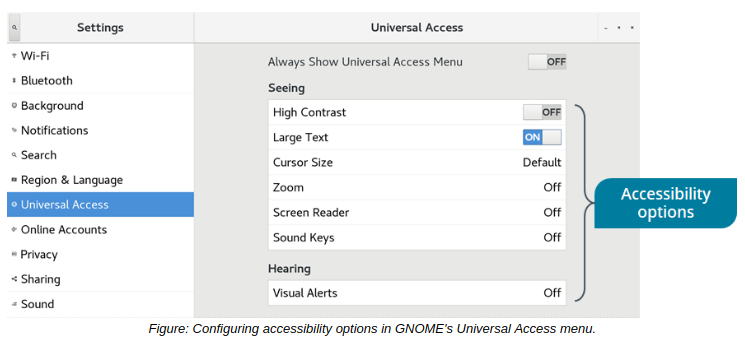

# Accessibility Options

#### Accessibility Options

Each desktop environment has its own accessibility options for accommodating people with disabilities. An accessibility option in one environment may not exist in another.

> _Note: Accessibility options available in one environment may not exist in another._

Some common options include:

-   A screen reader that reads all of the highlighted screen elements.
-   A magnifier that zooms in on specific sections of the screen.
-   Increasing the size of specific elements like text and the mouse pointer.
-   An on-screen keyboard that enables users to click to type text using the mouse, instead of - using a physical keyboard.
-   Keyboard accessibility options, including:
    -   Toggle keys, enabling the system to beep when keys like Caps Lock and Num Lock are pressed.
    -   Repeat keys, enabling the user to hold down a key in order to repeatedly enter it.
    -   Sticky keys, enabling users to press one key at a time instead of holding down multiple keys at once in order to activate a keyboard shortcut.
-   Visual themes like high contrast that make the screen easier to read for certain people with visual impairments.