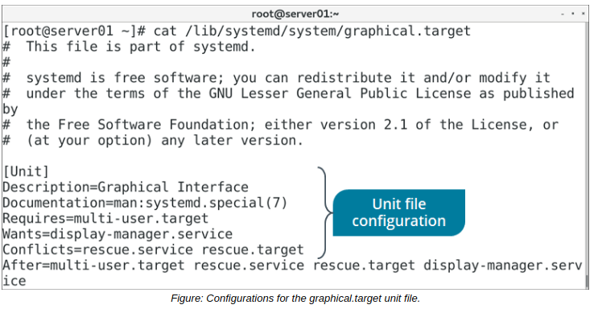

# THE systemd SUITE and systemd UNIT FILES

#### THE systemd SUITE

The **_systemd_** software suite provides an init method for initializing a system. It also provides tools for managing services on the system that derive from the init daemon. The systemd suite was designed as a replacement for other methods like SysVinit, and is now the dominant init method in modern Linux distributions.

The systemd suite offers several improvements over older methods. For example, it supports parallelization (starting programs at the same time for quicker boot) and reduces shell overhead. In systemd, Control Groups (cgroups) are used to track processes instead of process IDs (PIDs), which provides better isolation and categorization for processes.

#### systemd UNIT FILES

_**Unit files**_ are configuration files that systemd uses to determine how it will handle units, which are system resources that systemd can manage. Resources can include network services, block storage devices, peripheral devices, file systems, and much more. Daemons access and manage these resources. Resources are defined in one of several categories of unit files, making them easier to manage. A unit file's extension defines its category; e.g., a .automount file includes instructions for automatically mounting a mount point defined in a .mount unit file. Unit files are written in a declarative language using directives that tell systemd what to do.



Unit files can exist in multiple locations. The standard location that is used by software to install unit files is the `/lib/systemd/system/` directory. However, you shouldn't edit the unit files in this directory. If you want to modify a unit file's functionality, you should use the `/etc/systemd/system/` directory. Because unit files in this directory take precedence over files elsewhere, you can replace them here. If you want to modify only a portion of the unit file, you can create a directory named after the unit file with .d appended to it, then create a file within this directory that has a .conf extension. You can use this .conf file to extend or override specific functionality within the unit file.

**_ENVIRONMENT VARIABLES_**  
Unit files can also be used to set system environment variables/parameters, which are values that are passed from a parent process to any child processes it creates. By adding directives for an environment variable, you can make it easier for a service or other unit to work with custom values.

As an example, the `rescue.service` unit file sets the following Environment directive:

```Shell
[Service]
Environment=HOME=/root
``` 

The HOME environment variable is therefore set to the root user's home directory, enabling the rescue mode daemon to log in to the shell with that path as its home directory. When configuring your own unit files, you could use a similar directive, perhaps supplying a different path, You can also set any variable you want—not just HOME.