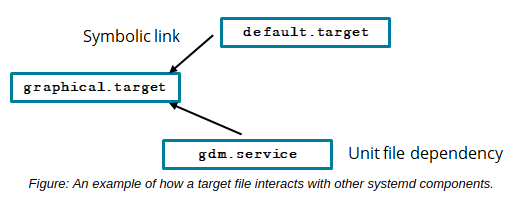

# systemd TARGETS

#### systemd TARGETS

In _**systemd**_, targets are a method of grouping unit configuration files together, typically to represent specific modes of operation. Each .target file is used to determine one of several ways in which the system can operate, such as running with just a CLI, running with a graphical desktop environment, initiating a system shut down, and more. You can therefore activate a target in order to boot into the desired environment.

Target files include dependency information that enables these different modes of operation. For example, graphical.target will boot the system into a GUI environment. It does this by referencing other unit files like `gdm.service` (the GNOME Display Manager) that are required in order to initialize the GUI and its related components.

