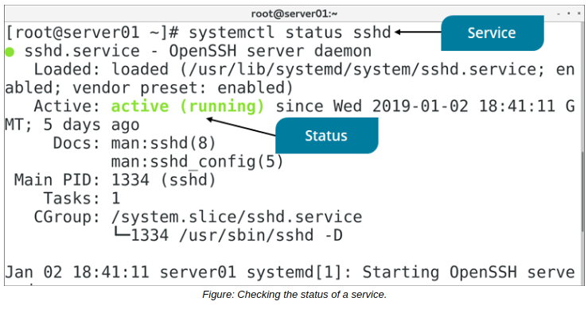

# THE systemctl COMMAND

#### THE systemctl COMMAND

The `systemctl` command enables you to control the systemd init daemon. You can view running services, manage (enable/disable) services to run at boot or in the current session, determine the status of these services, and manage the system target.

You can do all this through various subcommands issued along with the systemctl command, as detailed in the following table.

Subcommand | Used To
------ | -----
status {service} | Retrieve the current status of a service.
enable {service} | Enable a service to be started on boot.
disable {service} | Disable a service so that it is no longer started on boot.
start {service} | Start (activate) a service immediately.
stop {service} | Stop (deactivate) a service immediately.
restart {service} | Restart a service immediately.
set-default {target} | Set the default target for the system to use on boot.
isolate {target} | Force the system to immediately change to the provided target.
mask {unit file} | Prevent the provided unit file from being enabled or activated, even when done manually.
daemon-reload | Reload the systemd init daemon, including all unit files.

**_SYNTAX_**  
The syntax of the `systemctl` command is `systemctl [options] [subcommand] [arguments]`

**_systemctl COMMAND OPTIONS_**  
The systemctl command has many options, some of which are described in the following table.

Option | Used To
----- | -----
\-t {unit file type} | Specify the unit file types to perform the operation on.
\-a | List all unit files or properties, regardless of state.
\--no-reload | Prevent the reloading of configuration changes when enabling or disabling a service.
\--no-ask-password | Prevent users from being asked to authenticate when performing privileged operations.
\--runtime | Make changes temporary so that they will not be present after a reboot.
\-H {remote host} | Execute the operation on the remote host specified by IP address or hostname.
\--no-pager | Prevent the output from being piped into a paging utility.