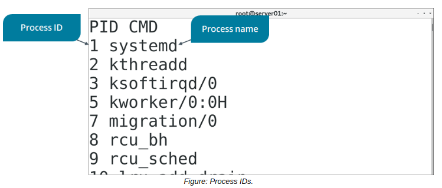

# Troubleshoot Process Issues

> **EXAM OBJECTIVES COVERED**
> 
> _2.4 Given a scenario, manage services.  
> 2.6 Given a scenario, automate and schedule jobs.  
> 4.2 Given a scenario, analyze system processes in order to optimize performance._

During operation of the system, you may encounter various issues that degrade performance or otherwise make the system unusable. In many cases, these issues impact services, daemons, and other instances of running software. So, in this topic, you'll switch from managing running software to troubleshooting problems that are caused by or affect that software.

#### Common Process Issues

There are many possible issues that could affect or be caused by a process, a running instance of software. These issues may include:

-   A process hangs, causing instability in that process.
-   A process hangs, consuming resources that should be allocated to other processes.
-   A process hangs, causing general system sluggishness and instability.
-   A process terminates before it can perform its intended tasks.
-   A process fails to terminate when it is no longer needed.
-   A process should be allocated most CPU resources but other processes are instead.
-   A process is causing the system to take a long time to boot.
-   A process has a file open, preventing you from modifying that file.
-   A process has spawned multiple child processes that are hard to keep track of.
-   A process is unidentifiable or potentially malicious.

#### Process States

Processes go through a lifecycle from creation until eventual termination. There are five different states that a process can be in during this lifecycle, each one defining how the system or other apps can interact with that process. Knowing a process's state can help you determine what to do with that process or help you diagnose problems concerning that process.

The five states are:

-   **Running**—The process is currently executing in user space or kernel space. In this state, the process can perform its assigned tasks.
-   **Interruptible sleep**—The process relinquishes access to the CPU and waits to be reactivated by the scheduler. A process typically enters this state when it requests currently unavailable resources. "Interruptable" implies that the process will wake from its sleep if a scheduler finds a time slot for it.
-   **Uninterruptible sleep**—In this sleep state, the process will only wake when the resource it's waiting for is made available to it. Otherwise, it will stay in its sleep state. This state is common for processes that perform storage or network I/O.
-   **Zombie**—This state indicates that a process was terminated, but that it has not yet been released by its parent process. It is in a "zombie-like" state where it cannot accept a kill signal because the process isn't available anymore.
-   **Stopped**—This state indicates that the process was stopped by a debugger or through a kill signal.

#### PROCESS IDs

Every process is assigned a unique **_process ID (PID)_** when it is started, so that the system and users can identify the process. This PID is a non-negative integer that increases for each new process that is started. The init daemon always has a PID of 1, because it is the first process to start and is the parent of all other processes on the system. Processes started after this, whether by the system or by the user, are assigned a higher available number.

When it comes to troubleshooting, you'll need to know a process's PID in order to terminate it, change its priority, and perform other management tasks on it.