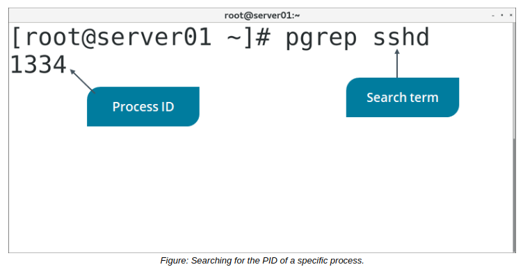
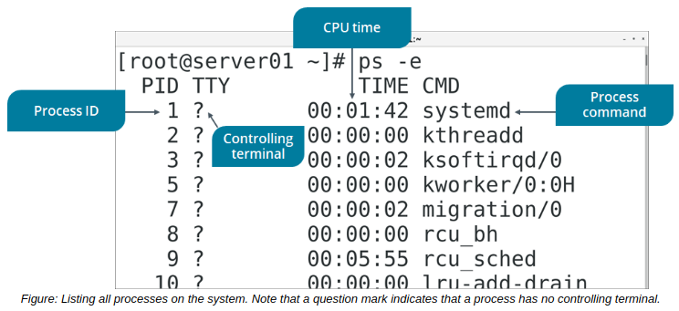

# THE pgrep AND ps COMMAND

#### THE pgrep COMMAND

The pgrep command displays the PID of processes that match any given pattern, similar to how grep is used to match patterns in a text file. Patterns can include: the name or user ID (UID) of the user who invoked it; the start time; the parent PID; and more. You can use pgrep to help you identify a process based on multiple factors when you don't know its exact PID. Identifying the PID is typically the first step in managing the process.

**_SYNTAX_**  
The syntax of the `pgrep` command is `pgrep [options] {pattern}`

#### THE ps COMMAND

The ps command invokes the **_process table_**, a record that summarizes the current running processes on a system. When the command is run without any option, it displays the processes run by the current shell with details such as the PID, the terminal associated with the process, the accumulated CPU time, and the command that started the process. However, different options may be used along with the command to filter the displayed fields or processes. 

**_SYNTAX_**  
The syntax of the `ps` command is `ps [options]`

**_ps COMMAND OPTIONS_**  
The ps command supports several options. Some of the more prominent options are listed here.

Option | Used To
------ | -------
a | List all user-triggered processes.
\-e | List all processes.
\-l | List processes using a long listing format.
u | List processes along with the user name and start time.
r | Exclude processes that are not running currently.
x | Include processes without a terminal.
T | Exclude processes that were started by any terminal other than the current one.
\-U {user name} | Display the processes based on the specified user.
\-p {PID} | Display only the process associated with the specified PID.
\-C {command} | Display all processes by command name.
\--tty {terminal number} | Display all processes running on the specified terminal.

  
**_COMMAND OPTION SYNTAX STYLES_**  
The ps command supports three different styles of command option syntax: Unix-style (preceded by a hyphen), GNU-style (preceded by two hyphens), and BSD-style (no hyphen). Mixing these styles will not always produce the same results. For example, the ps a command (BSD-style) will print all processes with a controlling terminal, including session leaders (the first member of a group of processes). It will also print the status of each process, as well as the full command (including options) of each process. The ps -a command (Unix-style) also prints all processes with a controlling terminal, but does not include session leaders, the status of each process, nor the full command of each process.