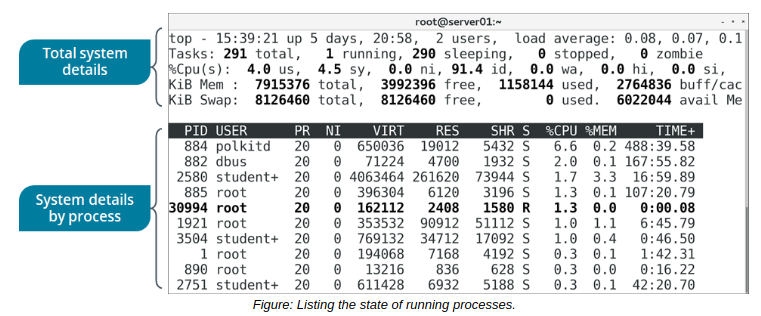

# THE top COMMAND

#### THE top COMMAND

Like ps, the top command lists all processes running on a Linux system. It acts as a process management tool by enabling you to prioritize, sort, or terminate processes interactively. It displays a dynamic process status, reflecting real-time changes.

 Different keystrokes within this tool execute various process management actions. Some of the frequently used command keys include the following.

Key | Used To
------- | -------
Enter | Refresh the status of all processes.
Shift+N | Sort processes in the decreasing order of their PID.
M | Sort processes by memory usage.
P | Sort processes by CPU usage.
u | Display processes belonging to the user specified at the prompt.
k | Terminate the process for which you specify the PID.
r | Renice the process for which you specify the PID.
q | Exit the process list.

  
**_SYNTAX_**  
The syntax of the `top` command is `top [options]`