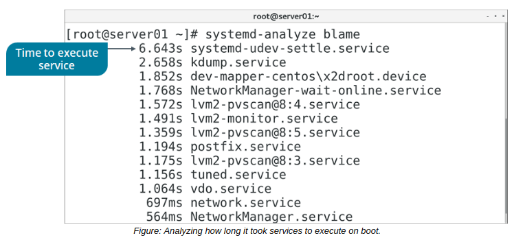

# THE systemd-analyze and lsof COMMAND

#### THE systemd-analyze COMMAND

The systemd-analyze command is used to retrieve performance statistics for boot operations. The command takes one or more subcommands that determine what type of information to print, and how. For process management and troubleshooting, blame is the most relevant subcommand. This will print a list of all systemd units that were executed at boot, along with the time it took each unit to execute. You can use systemd-analyze blame to identify services and other units that make the system slow to boot.

**_SYNTAX_**  
The syntax of the `systemd-analyze` command is `systemd-analyze [options] [subcommand]`

#### THE lsof COMMAND

The lsof command prints a list of all files that are currently opened to all active processes. This can include everything from a text file to a device file—any object that the system can parse as a file. You may be prevented from modifying a file if it is opened in another process. By using lsof you can identify the offending process for termination. You can also use lsof to analyze how a process uses files, which can be helpful in identifying malicious processes or processes that have unwanted side effects.

The lsof command prints each file opened by a process on its own line. It prints information such as:

-   The name of the command/process.
-   The PID.
-   The invoking user.
-   The file descriptor (FD), including what permissions the file is open with.
-   The type of file.
-   The name of the file.

**_SYNTAX_**  
The syntax of the `lsof` command is `lsof [options]`