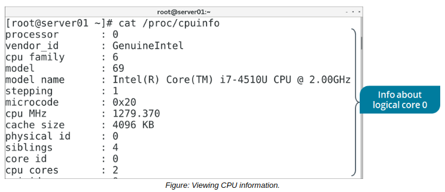

# Troubleshoot CPU and Memory Issues

> **EXAM OBJECTIVES COVERED**
> 
> _4.1 Given a scenario, analyze system properties and remediate accordingly._

The system needs to access certain hardware resources—particularly, the processor and memory—in order to provide functionality. Problems that affect these resources will cause major disruption to the system. So, in this topic, you'll use various Linux commands to identify and solve issues related to the CPU and RAM.

#### Common CPU Issues

There are many possible issues that could affect or be caused by the CPU. These issues may include:

-   The CPU is under-performing for the desired level of speed and responsiveness.
-   The CPU is being overloaded by too many requests and can't respond in time.
-   One or more CPU cores are non-functional and/or exhibiting reduced performance.
-   Processes are unable to access enough CPU time to run effectively.
-   Processes are consuming too much CPU time, leaving other processes without resources.
-   The CPU is spending too much time idle instead of processing.
-   The CPU doesn't support features like virtualization or hyperthreading.

#### THE /proc/cpuinfo FILE

The `/proc/cpuinfo` file contains information about the system's processor. You can use this information to identify characteristics about your CPU that might indicate issues related to performance or lack of support for features.

 Each logical processor core has its own entry. A CPU might support multithreading, which performs multiple operations simultaneously on a single physical core. Logical cores represent each possible thread. So, a CPU marketed as being a quad-core processor might have eight logical cores.

Some useful fields in the /proc/cpuinfo file include:

-   `processor` —The number of the logical core, starting with 0.
-   `vendor_id` —The CPU manufacturer.
-   `model name` —The specific model of CPU.
-   `cpu MHz` —The logical core's clock speed, measured out to the thousandths decimal place.
-   `cache size` —The CPU's cache size.
-   `flags` —Characteristics about the CPU as well as supported features.

**_CPU-BASED KERNEL PARAMETERS_**  
As you've seen, the `sysctl` command enables you to view kernel parameters at runtime.