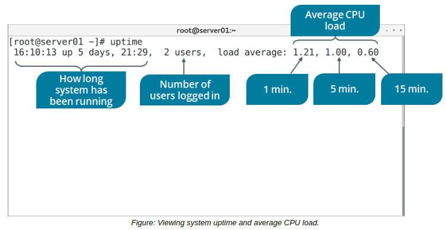
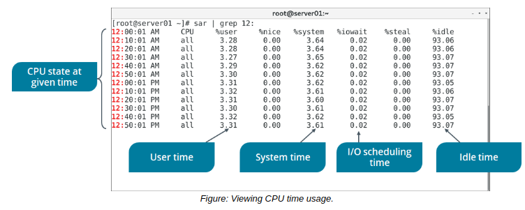

# THE uptime and sar COMMAND

#### THE uptime COMMAND

The uptime command displays the time from when a system started running. The output of the uptime command gives information about the current time, how long the system is running, and how many users are currently logged in.

Most relevant to CPU troubleshooting, however, is the load average field. A CPU's load is expressed as the number of processes that are either using or waiting to use the CPU. It can also include the number of processes in the queue for storage I/O. Using uptime you can find the average load over three different periods of time, from left to right in the output: the last 1 minute, the last 5 minutes, and the last 15 minutes.

You can use these values to determine when your CPU becomes overloaded, which may lead to performance issues. For example, if you have 4 logical cores, and the load average in the last 15 minutes is 4.0, then your CPU was being used fully. If your load average were 8.0, then your CPU would be 100% overloaded.

#### THE sar COMMAND

The sar command displays system usage reports based on data collected from system activity. These reports consist of various sections, each of which consists of the type of data and the time at which the data was collected. The default mode of the sar command displays CPU usage in various time increments for each category of resource that accessed the CPU, such as users, the system, I/O scheduling, etc. It also displays the percentage of the CPU that was idle at a given time. At the bottom of the report is an average of each data point across the listed time periods. By default, sar reports the data collected every 10 minutes, though you can use various options to filter and shape these reports.

Like the uptime command, you can use sar to identify excessive load on the CPU. You're given more details about when excessive usage occurs, as well as what might be causing that excessive usage.

**_SYNTAX_**  
The syntax of the `sar` command is `sar [options]`

**_CPU-BASED KERNEL PARAMETERS_**  
You can also use the sysctl command to troubleshoot CPU issues by retrieving CPU-based kernel parameters at runtime. One useful set of parameters concerns scheduling domains, a method by which the kernel groups logical cores that share scheduling policies and other properties. These parameters typically take the format: `kernel.sched_domain.cpu#.domain#.param`