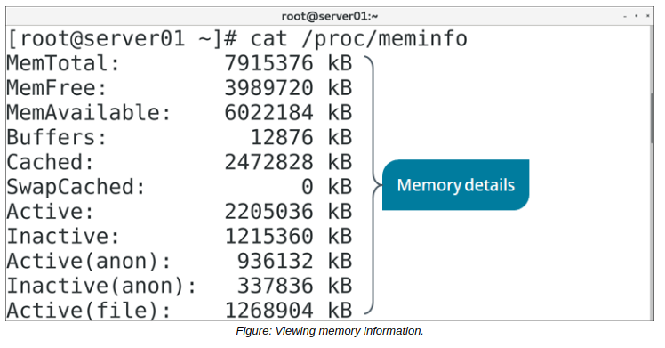

# Common Memory Issues

#### Common Memory Issues

There are many possible issues that could affect or be caused by memory. These issues may include:

-   Not enough total memory to service all processes at once.
-   Not enough free memory to service new processes.
-   Processes are unable to access memory despite being available.
-   Processes are accessing too much memory, leaving other processes without memory.
-   The system cannot quickly access files from a cache or buffer.
-   The system is killing critical processes when it is low on memory.
-   Swap partitions are taking up too much or not enough storage space.

#### THE /proc/meminfo FILE

The `/proc/meminfo` file contains a great deal of information about the system's memory usage. You can use this information to ensure that the system's RAM modules are performing to specification; that the OS is consuming memory at the expected rate; and that the system has enough available memory to perform intensive tasks.

Some useful fields in the `/proc/meminfo` file include:

-   `MemTotal` —The total amount of physical memory on the system.
-   `MemFree` —The total amount of physical memory that is currently unused.
-   `Cached` —The total amount of physical memory that is being used as cache memory.
-   `SwapTotal` —The total amount of swap space on the system.
-   `SwapFree` —The total amount of swap space that is currently unused.
-   `Dirty` —The total amount of memory that is waiting to be written to storage.
-   `Writeback` —The total amount of memory currently being written to storage.

> _Note: Most of these values are expressed in kilobytes (KBs)._

