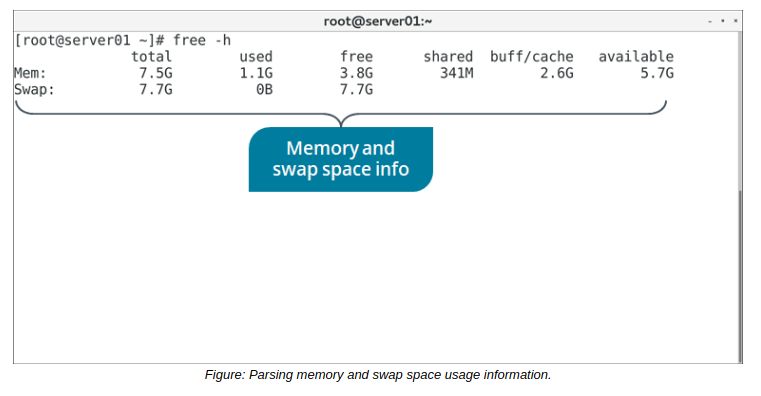

# THE free COMMAND

#### THE free COMMAND

The `free` command parses the `/proc/meminfo` file for easier analysis of memory usage statistics. Its default behavior is to display the following information about system memory and swap space:

-   The total memory.
-   The total used.
-   The total free.
-   The total shared.
-   The total buffered and cached.
-   The total available for starting new apps (estimated).

**_SYNTAX_**  
The syntax of the free command is `free [options]`

**_free OPTIONS_**  
There are several command options available for the free command.

Option | Used To
------- | -------
\-b, \-k, \-m, \-g, \-tera | Display memory in bytes, kilobytes, megabytes, gigabytes, and terabytes, respectively.
\-s {seconds} | Update memory statistics at a delay of the specified seconds.
\-o | Disable the display of the buffered/cached information.
\-t | Display a total line that combines physical RAM with swap space.
 \-h | Make the output more human-readable.

  

**_BUFFER/CACHE OUTPUT_**  
Memory can be cached, meaning that it is stored temporarily so that the data it contains can be accessed much quicker in the future. The Buffers field in `/proc/meminfo` indicates memory that is assigned to a specific block device. This memory is used to cache file system metadata, like directory contents, permissions, etc. The Cached memory is similar, but instead of storing file metadata, it stores the actual contents of files. The free command combines these two values together upon output.

> _Note: When the buffer/cache value is low, the system is low on memory._