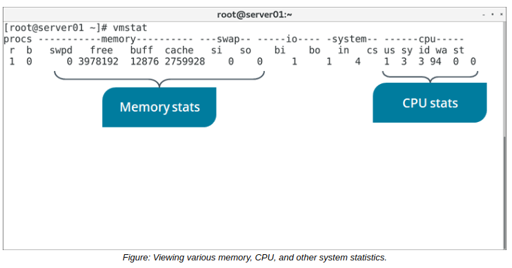

# THE vmstat COMMAND

#### THE vmstat COMMAND

The vmstat command displays various statistics about virtual memory, as well as process, CPU, and I/O statistics. By default, the report will provide averages of each statistic since the last system boot, though you can also specify a delay value to sample from a period of time.

Some memory-based statistics include:

-   The total virtual memory available.
-   The total virtual memory that is free for use.
-   The total memory used in buffers and cache.
-   The total memory used in swap space.

Some CPU-based statistics include:

-   Time spent running user space.
-   Time spent running in kernel space.
-   Time spent idle.
-   Time spent waiting for I/O.

> _Note: CPU times are expressed as percentages of total CPU time._

**_SYNTAX_**  
The syntax of the vmstat command is `vmstat [options] [delay [count]]`

**_OUTPUT DELAY_**  
It's recommended to supply vmstat with a delay for a more accurate report. For example, `vmstat 5 5` will run the command on a five-second delay for five intervals.