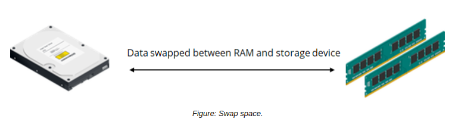

# Swap Space Configuration

#### Swap Space Configuration

The configuration of swap space can alleviate memory-related issues, especially when the system and applications request more memory than the system has. Systems with a low amount of RAM are particularly vulnerable to these issues. Swap space is not a replacement for adding more memory, but it can help minimize system and application sluggishness, unresponsiveness, and crashes.

**_SWAP SPACE TYPES_**  
Swap space can be one of three types.

Swap Type | Description
--------- | --------
Device swap | Device swap space is configured when you partition the storage device. It is used by the operating system to run large applications.
File system swap | File system swap space is configured primarily when you install Linux. It is used by the operating system as an emergency resource when the available swap space runs out.
Pseudo-swap | Pseudo-swap space enables large applications to run on computers with limited RAM.

  
**_SWAP FILES_**  
Swap files are created for storing data that is to be transferred from a system's memory to a storage device. They are dynamic and change in size when data is moved in and out of memory. Swap files are used as a medium to transfer data from RAM onto the storage device.

**_SWAP PARTITIONS_**  
A swap partition is an area of virtual memory on a storage device to complement the physical RAM in the computer. Swap partitions are used by Linux because they perform better than swap file systems.

#### THE mkswap COMMAND

The mkswap command is used to create swap space on a storage partition. It is typically used when you wish to move swap space to a different partition than the one that was created during system installation. For example, you might want to save space on a low-capacity boot drive.

It provides options to perform various tasks.

Option | Used To
------- | --------
\-c | Verify that the device is free from bad sectors before mounting the swap space.
\-p | Set the page size to be used by the mkswap command. A page is a chunk of memory that is copied to the storage device during the swap process.
\-L {label} | Activate the swap space using labels applied to partitions or file systems.

  

#### Swap Partition Management Commands

The `swapon` command is used to activate a swap partition in a specified device. The `swapoff` command is used to deactivate the swap space on a device.

Some of the frequently used `swapon` and `swapoff` command options are given in the following table.

Option | Used To
-------- | --------
swapon -e | Skip devices that do not exist.
swapon -a | Activate all of the swap space.
swapoff -a | Deactivate all of the swap space.