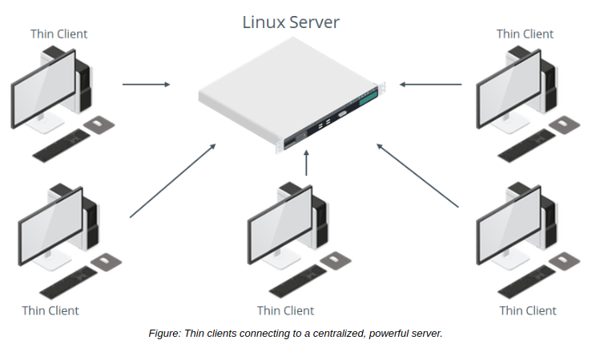

# Identify the Types of Linux Devices

> **EXAM OBJECTIVES COVERED**
> 
> _2.7 Explain the use and operation of Linux devices._

Before you begin using Linux commands to manage devices, you need to become familiar with the types of devices that Linux supports.

#### The Importance of Device Drivers

As you know, device drivers act as an interface between the operating system and hardware devices. Drivers are crucial for devices to function properly, or to even function at all within the Linux environment. While great strides have been made by both the Linux kernel developers and device manufacturers to write Linux-compatible drivers, there may still be compatibility issues with certain hardware. Ultimately, no matter what the device is that you're trying to use, you need to make sure it has proper driver support under Linux, and that your Linux system actually has those drivers. Otherwise, you may be unable to use that device, or use it well.

#### Thin Clients

A client device, typically referred to as a **_thin client_**, is any lightweight computing device that connects to a more powerful server for doing work. The server does most of the heavy lifting, including processing and storing data, while the thin client acts as little more than a user interface. This type of computing architecture centralizes operations, making it easier for administrators to manage groups of backend servers instead of workstations that are dispersed throughout the organization

As you've seen, Linux has robust remote connection support, whether through a GUI with remote desktop apps, or through a terminal with SSH. A thin client will typically have fundamental I/O devices like a keyboard, mouse, and monitor connected to it. It may or may not be running Linux, and if it is, it will typically be a lightweight distribution with very few features available or permissible to the user. The server the client connects to will usually construct a virtual environment so that the user can work in a sandbox, segmented from other portions of the server or network. The server, like the client, may be running Linux or another operating system.

#### USB Devices

**_Universal Serial Bus (USB)_** is a peripheral interface technology that has become the de facto standard for connecting input devices, external storage devices, mobile devices, and more, to computers. USB also incorporates plug-and-play technologies that enable devices to self-configure as soon as a connection is made.

A wide range of USB device types are supported in Linux, including, but not limited to:

-   Thumb drives
-   External HDDs and SSDs
-   Digital cameras
-   Smartphones and tablets
-   Printers and scanners
-   Keyboards and mice
-   Microphones and webcams
-   Game controllers

**_USB STORAGE AND DEVICE ASSIGNMENT_**  
Linux registers USB storage devices attached to the system in the format `/dev/sd#` in the same way as the SCSI/SATA naming convention.