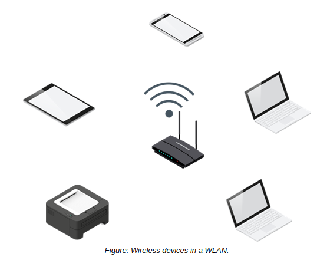

# Wireless , Video, Audio, And Printers Devices

#### Wireless Devices

Wireless devices transmit and receive signals over the air rather than through physical cables connected to ports. There are many different wireless networking protocols, each of which may have a specific or optimal application. Examples of common wireless networking protocols supported by Linux include:

-   **_Wi-Fi_**: A technology used primarily in establishing a wireless local area connection (WLAN) in home and office environments. Common devices include wireless routers and access points for networking infrastructure; and mobile devices, desktop computers, Internet of Things (IoT) devices, and many more that act as Wi-Fi clients. Wi-Fi routers and access points may often run some flavor of Linux, whereas Linux-based clients like Android smartphones and desktop computers can connect to those infrastructure devices.
-   **_Bluetooth_**: A technology used primarily for establishing a personal area network (PAN) in which devices communicate wirelessly within a few feet of each other. A common application is when wireless headsets or headphones are paired with a smartphone or other computing device, enabling the user to listen to audio without the need for cabling. As you've seen, Linux has Bluetooth driver support and can act as either end of the pairing.
-   **_Near Field Communication (NFC)_**: A communications protocol used by mobile devices and peripherals that are either touching or only inches apart. NFC is often used to quickly share data from one device to another. As with Bluetooth, support for NFC on Android mobile devices is robust. There is also Linux support for some NFC adapters and discrete devices that connect to traditional computers.

#### Video and Audio Devices

Video and audio devices are I/O peripherals that are usually attached to client systems like desktops and laptops, or thin clients. Common video input peripherals include webcams, surveillance cameras, and digital cameras. Common video output peripherals include monitors, televisions, and projectors. Microphones are the most common audio input peripheral, but certain video input peripherals also capture audio. Likewise, monitors and televisions can usually output audio, but audio-only output devices like speakers and headphones are also popular.

When you connect a video/audio peripheral to a system running any OS, including Linux, you need to be mindful of the connection types it uses and what types are available on the system. Microphones and webcams commonly use USB, whereas USB is much less effective for streaming video/audio output in real-time. Monitors, for example, are more likely to use interfaces like HDMI and DisplayPort that can carry both video and audio signals with a high degree of real-time performance. Some monitors may use older interfaces like DVI and VGA that only carry video.

#### Printers

Like most other operating systems, Linux provides support for printers. Support for a specific type of printer is dependent on whether or not there are available drivers for the Linux kernel to use, and how robust those drivers are. As driver support in the kernel has improved over the years, so too has support for many printers offered by most major vendors.

You can connect to a printer using one or more interfaces and methods. Most modern printers offer local connection support through a USB interface. However, in office environments especially, clients often connect to printers over a network. In this case, the printer may include a Wi-Fi adapter, an Ethernet adapter, or both, so that the printer is identifiable on the LAN. Multiple clients can therefore connect to and use the same printer at once. A Linux computer can even function as a print management server that interfaces with one or more physical printers.