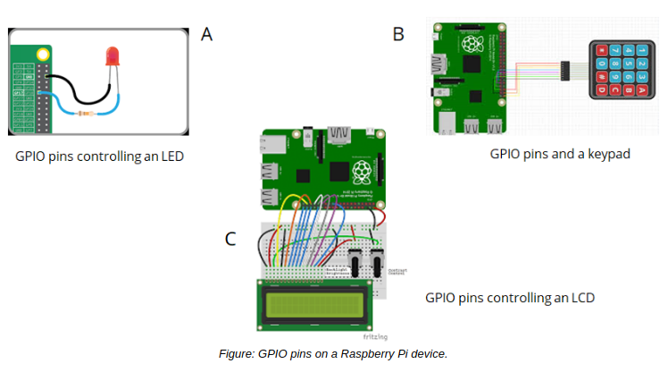

# Network Adapters, GPIO, And SATA

#### Network Adapters

A **_network adapter_**, also known as a **_network interface card (NIC)_**, is a device that provides an interface with which hosts exchange data over a network. A network adapter is mandatory for any computing device that needs access to a network, whether a small LAN or a wider network like the Internet.

In many cases, network adapters are built into a computer's motherboard. However, some adapters can be added to the system on an expansion bus, or as an external peripheral that connects through an interface like USB. A system can have more than one adapter; this is especially common in servers and security systems like firewalls. In addition, each type of network connection protocol requires its own type of adapter. A Wi-Fi adapter sends and receives wireless signals in a WLAN, whereas an Ethernet adapter will include an Ethernet port that you can plug a cable into to connect to a LAN.

#### GPIO

**_General-purpose input/output (GPIO)_** refers to pins on a circuit board that have no designated purpose, but are controllable by the user at runtime. These pins send and receive digital signals and can be in an on or off state. For example, a pin designated as output can turn an LED light on or off; and a pin designated as input can itself be turned on or off from an external source like a light switch. In most cases, GPIO functionality is controlled programmatically through software. A developer might design their app to send or receive signals to and from the pins so that the app can interface with the outside world.

GPIO pins are commonly found on single-board microcontrollers like Arduino and Raspberry Pi devices. While these devices are often used by hobbyists and as a way to teach fundamental computing concepts, they also have applications in the IoT space. Specialized Linux distributions like Raspbian can be used to control GPIO functionality on single-board microcontrollers through various programming libraries.

#### SATA

**_Serial AT Attachment (SATA)_** is a computer bus interface standard for attaching storage devices to traditional computers. In modern PCs, including those running Linux, SATA has largely replaced earlier standards like Parallel ATA (PATA) and Integrated Drive Electronics (IDE) as one of the dominant standards in storage connection technology.

In the past, SATA was seen as a good solution for situations where capacity and cost were paramount. SATA supports multiple-terabyte drives and is relatively cheap to manufacturer. Its slower data transfer rate compared to alternative standards made it less suitable for enterprise environments. SATA is therefore commonly used for backup purposes and in consumer storage. However, the current revision of SATA, 3.2, supports a raw data rate of up to 16 gigabits per second (Gb/s), which rivals its competitors. Revision 3.2 combines SATA with another bus technology called PCI Express for these higher speeds. Standard SATA versions support up to 6 Gb/s (revision 3.1).