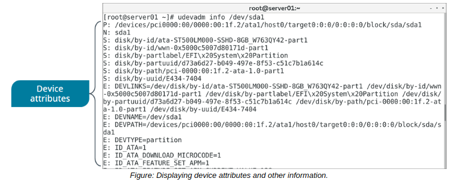

# THE udevadm COMMAND

#### THE udevadm COMMAND

The udevadm command is used to manage udev. It takes various subcommands, each of which performs a certain task to modify the behavior of the systemd-udevd daemon and related components. Some of these subcommands are described in the following table.

Subcommand | Used To
----- | -------
info | Retrieve device information stored in the udev database, as well as detailed device attributes from the /sys/ file system. For example, you can view a device's vendor ID, product ID, serial number, and much more.
control | Modify the running state of udev. For example, providing the \--reload-rules option will ensure that udev is reading from any new rules files you've added.
trigger | Execute rules that apply to any device that is currently plugged in. You can also specify an action using the \-coption, such as add, remove, or change. As the names imply, these will trigger events where a device is added, removed, or changed in the running kernel.
monitor | Watch for events sent by the kernel or by a udev rule.
test | Simulate a udev event running for a device, with results on output.

  

**_SYNTAX_**  
The syntax of the udevadm command is `udevadm [options] [subcommand] [arguments]`